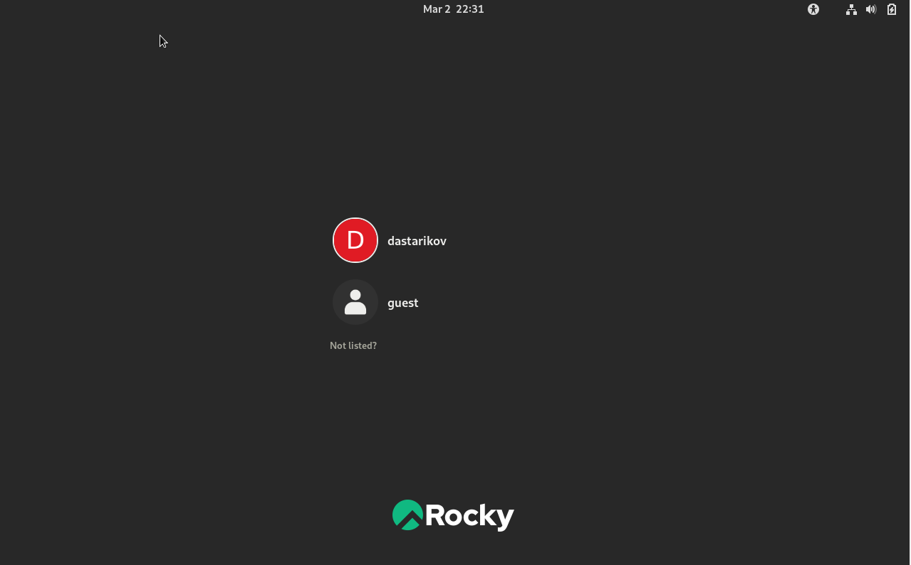

---
## Front matter
lang: ru-RU
title: Лабораторная работа №2
subtitle: Дискреционное разграничение прав в Linux. Основные атрибуты.
author:
  - Стариков Д. А.
institute:
  - Российский университет дружбы народов, Москва, Россия
date: 02 марта 2023

## i18n babel
babel-lang: russian
babel-otherlangs: english

## Formatting pdf
toc: false
toc-title: Содержание
slide_level: 2
aspectratio: 169
section-titles: true
theme: metropolis
header-includes:
 - \metroset{progressbar=frametitle,sectionpage=progressbar,numbering=fraction}
 - '\makeatletter'
 - '\beamer@ignorenonframefalse'
 - '\makeatother'
---

# Цели и задачи

- Получение практических навыков работы в консоли с атрибутами файлов
- Закрепление теоретических основ дискреционного разграничения доступа в современных системах с открытым кодом на базе ОС Linux.

# Результаты

## Создание нового пользователя

{#fig:0 width=70%}

## Домашняя директория, UID и GID

{#fig:1 width=70%}

## Домашняя директория, UID и GID

{#fig:2 width=70%}

## Работа с атрибутами каталогов

{#fig:6 width=70%}

## Работа с атрибутами каталогов

{#fig:5 width=70%}

## Работа с атрибутами каталогов

{#fig:9 width=70%}

## Заполнение таблицы

{#fig:10 width=70%}

## Заполнение таблицы

{#fig:11 width=70%}

# Итог

- В результате выполнения лабораторной работы получены практические навыки работы в консоли с атрибутами файлов.

