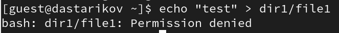

---
## Front matter
title: "Лабораторная работа №2"
subtitle: "Дискреционное разграничение прав в Linux. Основные атрибуты."
author: "Стариков Данила Андреевич"

## Generic otions
lang: ru-RU
toc-title: "Содержание"

## Bibliography
bibliography: bib/cite.bib
csl: pandoc/csl/gost-r-7-0-5-2008-numeric.csl

## Pdf output format
toc: true # Table of contents
toc-depth: 2
lof: false # List of figures
lot: false # List of tables
fontsize: 12pt
linestretch: 1.5
papersize: a4
documentclass: scrreprt
## I18n polyglossia
polyglossia-lang:
  name: russian
  options:
	- spelling=modern
	- babelshorthands=true
polyglossia-otherlangs:
  name: english
## I18n babel
babel-lang: russian
babel-otherlangs: english
## Fonts
mainfont: PT Serif
romanfont: PT Serif
sansfont: PT Sans
monofont: PT Mono
mainfontoptions: Ligatures=TeX
romanfontoptions: Ligatures=TeX
sansfontoptions: Ligatures=TeX,Scale=MatchLowercase
monofontoptions: Scale=MatchLowercase,Scale=0.9
## Biblatex
biblatex: true
biblio-style: "gost-numeric"
biblatexoptions:
  - parentracker=true
  - backend=biber
  - hyperref=auto
  - language=auto
  - autolang=other*
  - citestyle=gost-numeric
## Pandoc-crossref LaTeX customization
figureTitle: "Рис."
tableTitle: "Таблица"
listingTitle: "Листинг"
lofTitle: "Список иллюстраций"
lotTitle: "Список таблиц"
lolTitle: "Листинги"
## Misc options
indent: true
header-includes:
  - \usepackage{indentfirst}
  - \usepackage{float} # keep figures where there are in the text
  - \floatplacement{figure}{H} # keep figures where there are in the text
---

# Цель работы

Получение практических навыков работы в консоли с атрибутами файлов, закрепление теоретических основ дискреционного разграничения доступа в современных системах с открытым кодом на базе ОС Linux.

# Выполнение лабораторной работы

1. В установленной при выполнении предыдущей лабораторной работы операционной системе создали учётную запись пользователя guest (используя учётную запись администратора) (Рис. [-@fig:0]):
```
useradd guest
```
2. Задали пароль для пользователя guest (использую учётную запись ад-
министратора) (Рис. [-@fig:0]):
```
passwd guest
```
{#fig:0 width=70%}

3. Вошли в систему от имени пользователя guest (Рис. [-@fig:1]).

{#fig:1 width=70%}

4. Определили директорию, в которой находимся, командой pwd (Рис. [-@fig:2]). 
5. Уточнили имя пользователя командой whoami (Рис. [-@fig:2]).
6. Уточнили имя пользователя, группу, а также группы, куда входит пользователь, командой id. Сравнили вывод id с выводом команды groups (Рис. [-@fig:2]).
7. Сравнили полученную информацию об имени пользователя с данными, выводимыми в приглашении командной строки (Рис. [-@fig:2]).

{#fig:2 width=70%}

8. Просмотрели файл /etc/passwd командой (Рис. [-@fig:4])
```
cat /etc/passwd | grep guest
```
{#fig:4 width=70%}

И определили gid=1001 и uid=1001 пользователя guest.
9. Определили существующие в системе директории командой (Рис. [-@fig:6])
```
ls -l /home/
```

10. Проверили, какие расширенные атрибуты установлены на поддиректориях, находящихся в директории /home, командой (Рис. [-@fig:6]): 
```
lsattr /home
```

Удалось увидеть расширенные атрибуты только пользователя guest, так как он исполнял команду.

{#fig:6 width=70%}

11. Создали в домашней директории поддиректорию dir1 командой (Рис. [-@fig:6])
```
mkdir dir1
```
Определили командами ls -l и lsattr, какие права доступа и расширенные атрибуты были выставлены на директорию dir1 (Рис. [-@fig:5]).

{#fig:5 width=70%}

12. Снияли с директории dir1 все атрибуты командой (Рис. [-@fig:9])
```
chmod 000 dir1
```
и проверили с её помощью правильность выполнения команды (Рис. [-@fig:9])
```
ls -l
```
13. Попытались создать в директории dir1 файл file1 командой (Рис. [-@fig:9])
```
echo "test" > /home/guest/dir1/file1
```
Так как у пользователя guest нет доступа к записи в директорию, мы не смогли создать внутри новый файл.

{#fig:9 width=70%}

14. Заполнили таблицу «Установленные права и разрешённые действия» выполняя действия от имени владельца директории (файлов), определив опытным путём, какие операции разрешены, а какие нет (Рис. [-@fig:10]).
15. На основании заполненной таблицы определите те или иные минимально необходимые права для выполнения операций внутри директории dir1, заполните табл. "Минимальные права для совершения операций" (Рис. [-@fig:11]).

{#fig:10 width=70%}

{#fig:11 width=70%}

# Выводы

В результате выполнения лабораторной работы получены практические навыки работы в консоли с атрибутами файлов.


