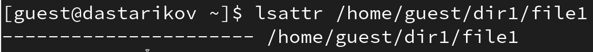
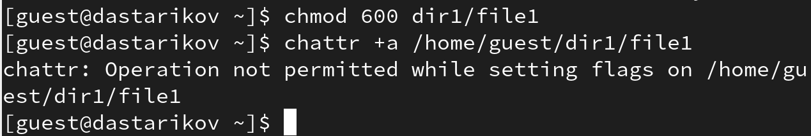
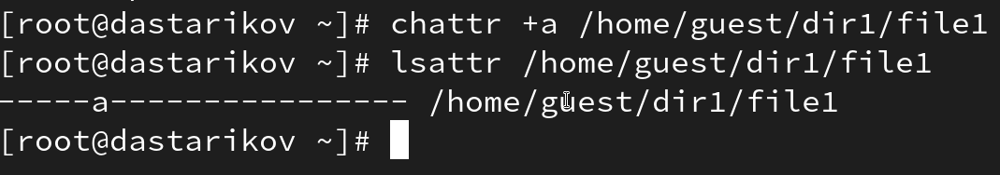
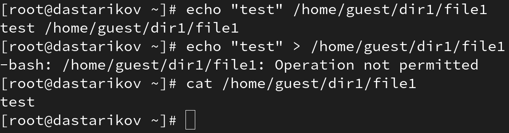
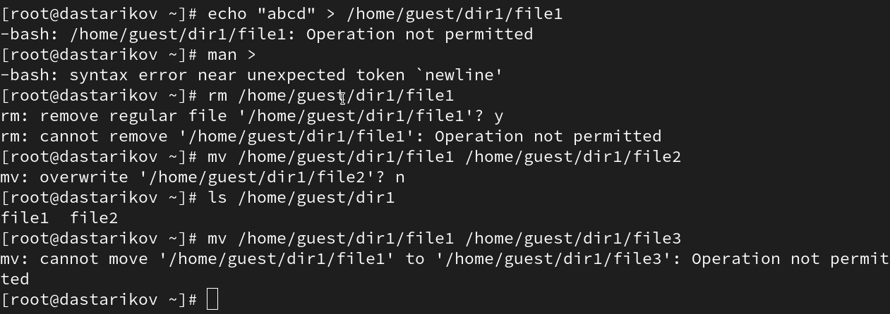
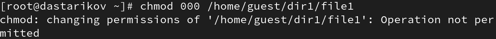
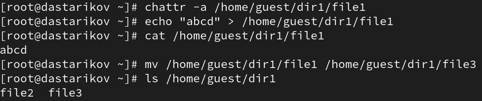
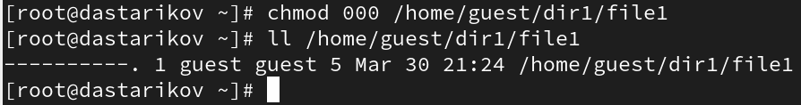
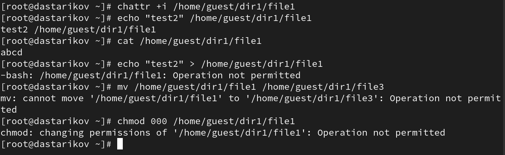

---
## Front matter
lang: ru-RU
title: "Лабораторная работа №4."
subtitle: "Дискреционное разграничение прав в Linux. Расширенные атрибуты"
author: 
author:
  - Стариков Данила Андреевич

date: 30 марта 2024

## i18n babel
babel-lang: russian
babel-otherlangs: english

## Formatting pdf
toc: false
toc-title: Содержание
slide_level: 2
aspectratio: 169
section-titles: true
theme: metropolis
header-includes:
 - \metroset{progressbar=frametitle,sectionpage=progressbar,numbering=fraction}
 - '\makeatletter'
 - '\beamer@ignorenonframefalse'
 - '\makeatother'
---

# Цели и задачи

- Получение практических навыков работы в консоли с расширенными атрибутами файлов

# Результаты

{#fig:1 width=100%}

## Попытка установки расширенного атрибута

{#fig:2 width=100%}

## Установка расширенного атрибута под root

{#fig:3 width=100%}

## Проверка доступных операций с файлом с флагом а

{#fig:4 width=100%}

## Проверка доступных операций с файлом с флагом а

{#fig:6 width=100%}

## Проверка доступных операций с файлом с флагом а

{#fig:7 width=100%}

## Проверка доступных операций с file1 без флага a

{#fig:8 width=100%}

## Проверка доступных операций с file1 без флага a

{#fig:9 width=100%}

## Проверка доступных операций с файлом с флагом i

{#fig:10 width=100%}

# Итог

- В рамках лабораторной работы получили практические навыки работы с основыми и расширенными атрибутами при разграничении доступа.

