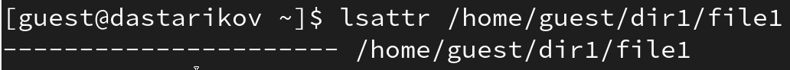
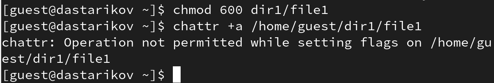
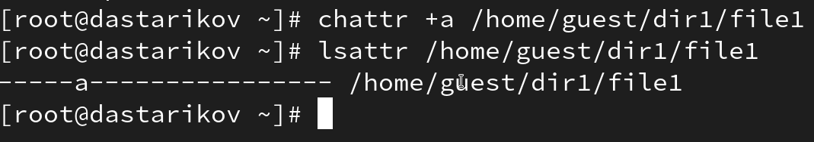
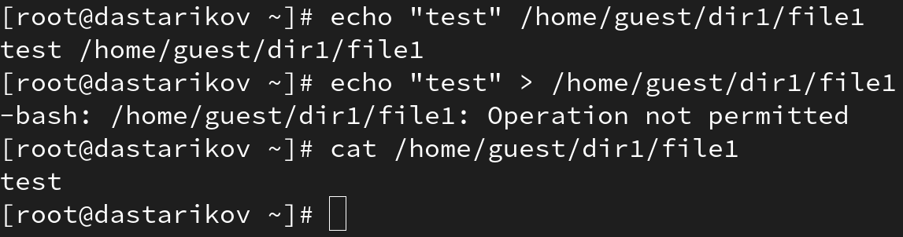
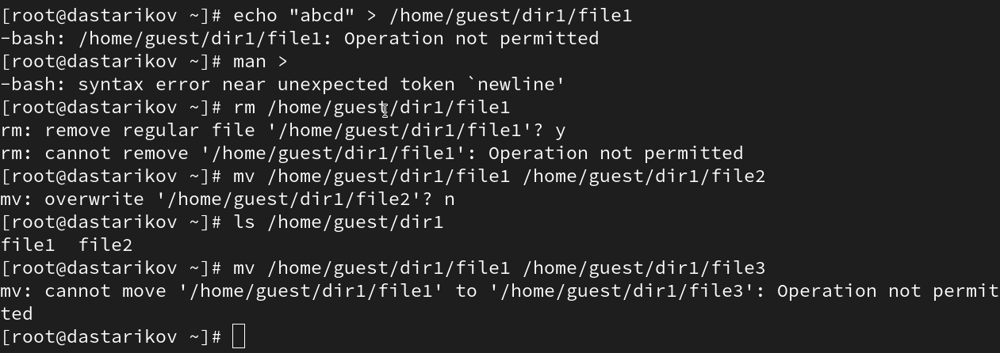
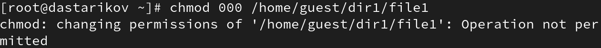
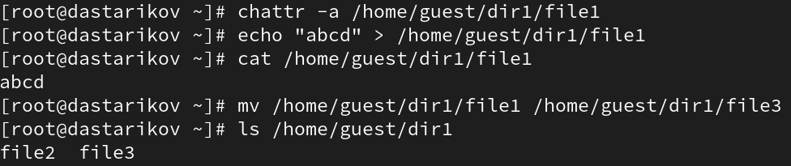
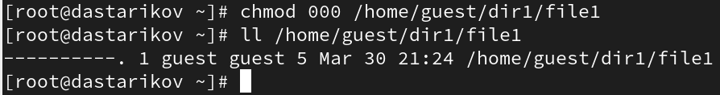
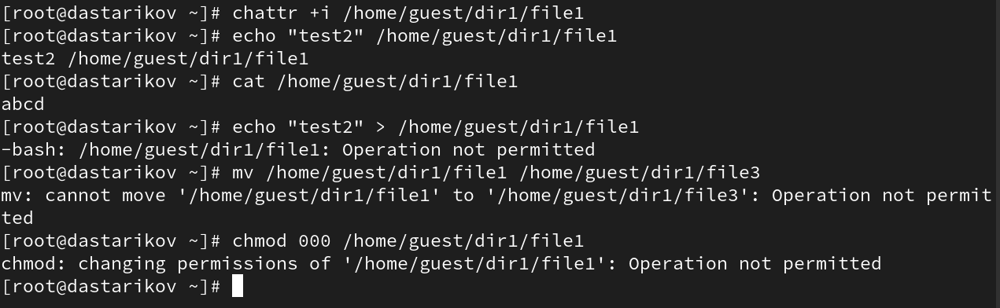

---
## Front matter
title: "Лабораторная работа №4."
subtitle: "Дискреционное разграничение прав в Linux. Расширенные атрибуты"
author: "Стариков Данила Андреевич"

## Generic otions
lang: ru-RU
toc-title: "Содержание"

## Bibliography
bibliography: bib/cite.bib
csl: pandoc/csl/gost-r-7-0-5-2008-numeric.csl

## Pdf output format
toc: true # Table of contents
toc-depth: 2
lof: false # List of figures
lot: false # List of tables
fontsize: 12pt
linestretch: 1.5
papersize: a4
documentclass: scrreprt
## I18n polyglossia
polyglossia-lang:
  name: russian
  options:
	- spelling=modern
	- babelshorthands=true
polyglossia-otherlangs:
  name: english
## I18n babel
babel-lang: russian
babel-otherlangs: english
## Fonts
mainfont: PT Serif
romanfont: PT Serif
sansfont: PT Sans
monofont: PT Mono
mainfontoptions: Ligatures=TeX
romanfontoptions: Ligatures=TeX
sansfontoptions: Ligatures=TeX,Scale=MatchLowercase
monofontoptions: Scale=MatchLowercase,Scale=0.9
## Biblatex
biblatex: true
biblio-style: "gost-numeric"
biblatexoptions:
  - parentracker=true
  - backend=biber
  - hyperref=auto
  - language=auto
  - autolang=other*
  - citestyle=gost-numeric
## Pandoc-crossref LaTeX customization
figureTitle: "Рис."
tableTitle: "Таблица"
listingTitle: "Листинг"
lofTitle: "Список иллюстраций"
lotTitle: "Список таблиц"
lolTitle: "Листинги"
## Misc options
indent: true
header-includes:
  - \usepackage{indentfirst}
  - \usepackage{float} # keep figures where there are in the text
  - \floatplacement{figure}{H} # keep figures where there are in the text
---

# Цель работы

Получение практических навыков работы в консоли с расширенными атрибутами файлов.

# Выполнение лабораторной работы

1. От имени пользователя guest определили расширенные атрибуты файла ``/home/guest/dir1/file1`` командой (Рис. [-@fig:1])

```
lsattr /home/guest/dir1/file1
```

{#fig:1 width=70%}

2. Установили командой

```
chmod 600 file1
```

на файл ``file1`` права, разрешающие чтение и запись для владельца файла (Рис. [-@fig:2]).

3. Попробовали установить на файл ``/home/guest/dir1/file1`` расширенный атрибут ``a`` от имени пользователя ``guest`` (Рис. [-@fig:2]):

```
chattr +a /home/guest/dir1/file1
```

В ответ получили отказ от выполнения операции. Подробности работы команды ``chattr`` см. в [@chattr_manpages]. О организации доступа к файлам можно узнать в Главе 4 [@tanenbaum_book_modern-os_ru].

{#fig:2 width=70%}

4. Зашли на вторую консоль с правами администратора. Установили расширенный атрибут ``a`` на файл ``/home/guest/dir1/file1`` от имени суперпользователя (Рис. [-@fig:3]):

```
chattr +a /home/guest/dir1/file1
```

5. От пользователя ``guest`` проверили правильность установления атрибута (Рис. [-@fig:3]):

```
lsattr /home/guest/dir1/file1
```

{#fig:3 width=70%}

6. Выполнили дозапись в файл ``file1`` слова «test» командой (Рис. [-@fig:4])

```
echo "test" /home/guest/dir1/file1
```

После этого выполнили чтение файла ``file1`` командой (Рис. [-@fig:4])

```
cat /home/guest/dir1/file1
```

Убедились, что слово ``test`` было успешно записано в ``file1``.

{#fig:4 width=70%}

7. Попробовали удалить файл ``file1`` либо стереть имеющуюся в нём информацию командой (Рис. [-@fig:6])

```
echo "abcd" > /home/guest/dirl/file1
```

Попробовали переименовать файл (Рис. [-@fig:7]):

```
mv /home/guest/dir1/file1 /home/guest/dir1/file3
```

{#fig:6 width=70%}

8. Попробовали с помощью команды
```
chmod 000 file1
```
установить на файл ``file1`` права, например, запрещающие чтение и запись для владельца файла (Рис. [-@fig:7]). Получил отказ в выполнении команды.

{#fig:7 width=70%}

9. Сняли расширенный атрибут ``a`` с файла ``/home/guest/dirl/file1`` от имени суперпользователя командой (Рис. [-@fig:8])
```
chattr -a /home/guest/dir1/file1
```
Повторите операции, которые вам ранее не удавалось выполнить (Рис. [-@fig:8]--[-@fig:9]):

```
echo "abcd" > /home/guest/dirl/file1
mv /home/guest/dir1/file1 /home/guest/dir1/file3
chmod 000 file1
```


{#fig:8 width=70%}

{#fig:9 width=70%}

10. Повторили действия по шагам, заменив атрибут «a» атрибутом «i» (Рис. [-@fig:10]). Дозапись в конец файла не выполняется, как и остальные действия с ``file1``.

```
chattr +i /home/guest/dir1/file1
```

{#fig:10 width=70%}

# Выводы

В рамках лабораторной работы получили практические навыки работы с основыми и расширенными атрибутами при разграничении доступа.

# Список литературы{.unnumbered}

::: {#refs}
:::
