---
## Front matter
lang: ru-RU
title: "Лабораторная работа №5."
subtitle: "Дискреционное разграничение прав в Linux. Исследование влияния дополнительных атрибутов"
author: "Стариков Данила Андреевич"

date: 13 апреля 2024

## i18n babel
babel-lang: russian
babel-otherlangs: english

## Formatting pdf
toc: false
toc-title: Содержание
slide_level: 2
aspectratio: 169
section-titles: true
theme: metropolis
header-includes:
 - \metroset{progressbar=frametitle,sectionpage=progressbar,numbering=fraction}
 - '\makeatletter'
 - '\beamer@ignorenonframefalse'
 - '\makeatother'
---

# Цели и задачи

- Изучение механизмов изменения идентификаторов, применения SetUID- и Sticky-битов
- Получение практических навыков работы в консоли с дополнительными атрибутами
- Рассмотрение работы механизма смены идентификатора процессов пользователей, а также влияние бита Sticky на запись и удаление файлов

# Результаты

## Создание программы

```c
#include<sys/types.h>
#include<unistd.h>
#include<stdio.h>

int main(){
    uid_t uid = geteuid();
    gid_t gid = getegid();
    printf("uid=%d, gid=%d\n", uid, gid);
    return 0;
}
```

## Создание программы

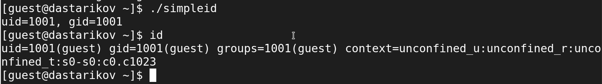{#fig:1 width=70%}


## Создание программы

```c
#include<sys/types.h>
#include<unistd.h>
#include<stdio.h>

int main(){
    uid_t real_uid = getuid();
    uid_t e_uid = geteuid();
    gid_t real_gid = getgid();
    gid_t e_gid = getegid() ;
    printf("e_uid=%d, e_gid=%d\n", e_uid, e_gid);
    printf("real_uid=%d, real_gid=%d\n", real_uid, real_gid);
    return 0;
}
```

## Создание программы

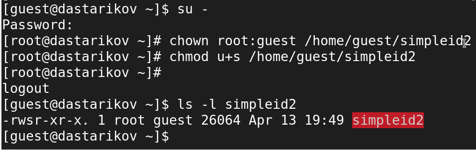{#fig:2 width=70%}

## Создание программы

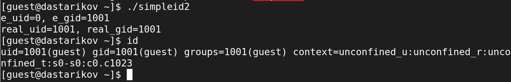{#fig:3 width=70%}

## Создание программы

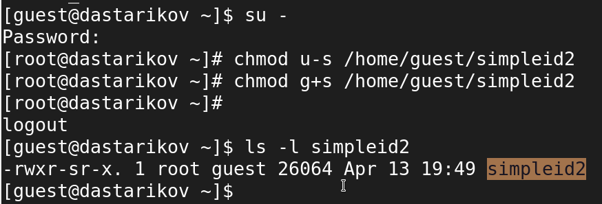{#fig:4 width=70%}

## Создание программы

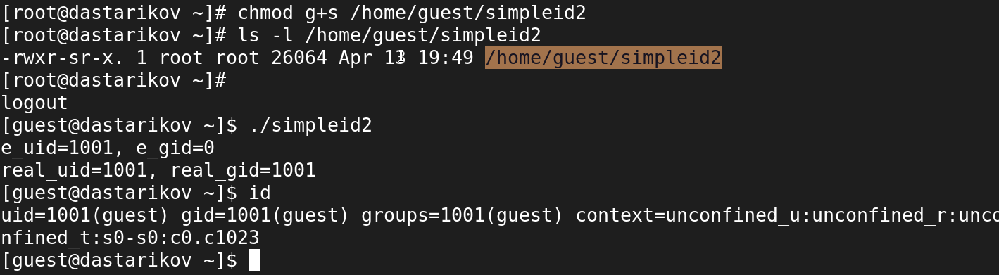{#fig:5 width=70%}

## Создание программы

```c
#include<fcntl.h>
#include<stdio.h>
#include<sys/stat.h>
#include<sys/types.h>
#include<unistd.h>
int main(int argc, char* argv[]){
    unsigned char buffer[16];
    size_t bytes_read;
    int fd = open(argv[1], O_RDONLY);
    do{	bytes_read = read(fd, buffer, sizeof (buffer));
	for (int i=0;i<bytes_read;++i) printf("%c", buffer[i]);
    } while (bytes_read == sizeof(buffer));
    close(fd);
    return 0;}
```

## Создание программы

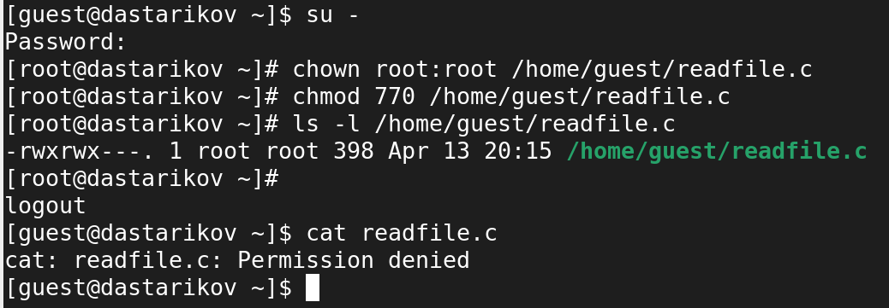{#fig:6 width=70%}

## Создание программы

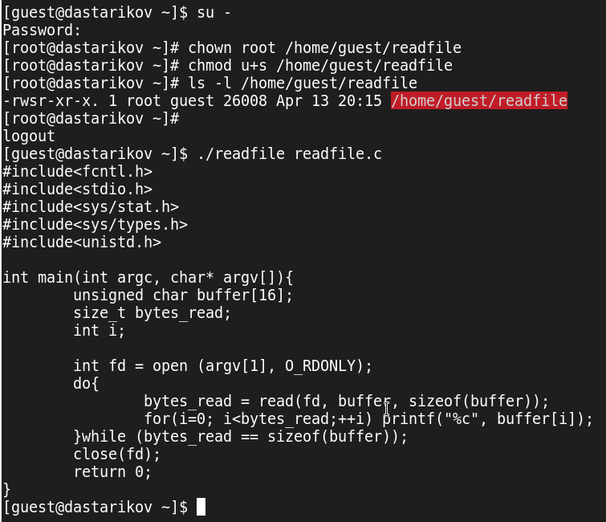{#fig:7 width=70%}

## Создание программы

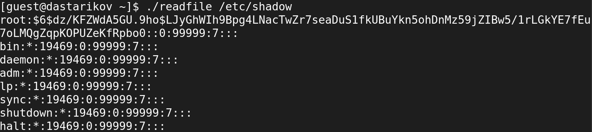{#fig:8 width=70%}

## Исследование Sticky-бита


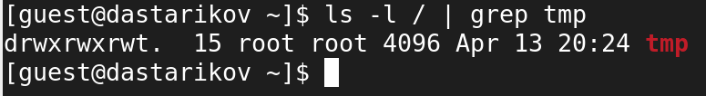{#fig:9 width=70%}

## Исследование Sticky-бита

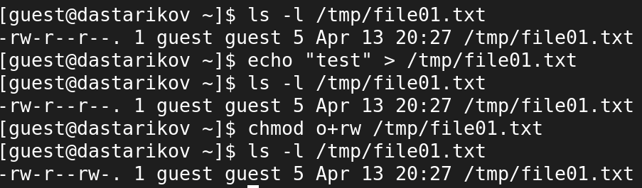{#fig:10 width=70%}

## Исследование Sticky-бита

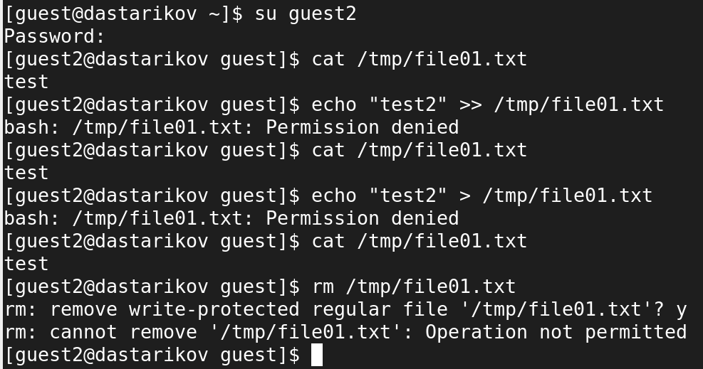{#fig:11 width=70%}

## Исследование Sticky-бита

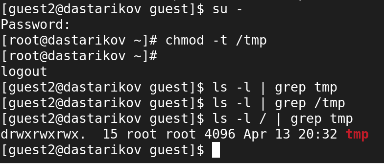{#fig:12 width=70%}

## Исследование Sticky-бита

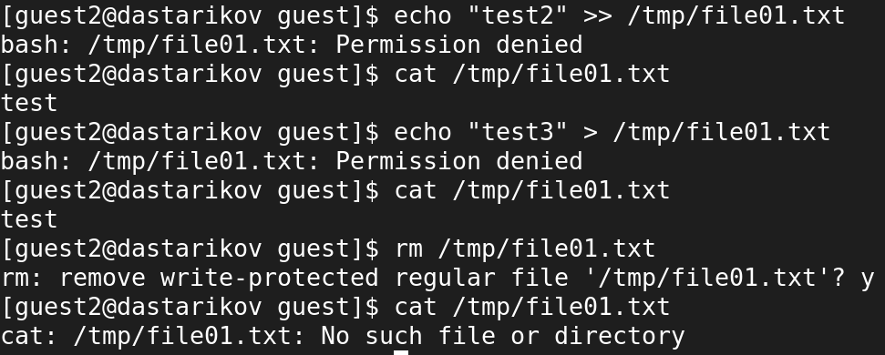{#fig:13 width=70%}

# Итог

- В рамках лабораторной работы изучили механизмы изменения идентификаторов, применения SetUID- и Sticky-битов, Получили практические навыкы работы в консоли с дополнительными атрибутами. Рассмотрели работы механизма смены идентификатора процессов пользователей, а также влияние бита Sticky на запись и удаление файлов.


