---
## Front matter
title: "Лабораторная работа №5."
subtitle: "Дискреционное разграничение прав в Linux. Исследование влияния дополнительных атрибутов"
author: "Стариков Данила Андреевич"

## Generic otions
lang: ru-RU
toc-title: "Содержание"

## Bibliography
bibliography: bib/cite.bib
csl: pandoc/csl/gost-r-7-0-5-2008-numeric.csl

## Pdf output format
toc: true # Table of contents
toc-depth: 2
lof: false # List of figures
lot: false # List of tables
fontsize: 12pt
linestretch: 1.5
papersize: a4
documentclass: scrreprt
## I18n polyglossia
polyglossia-lang:
  name: russian
  options:
	- spelling=modern
	- babelshorthands=true
polyglossia-otherlangs:
  name: english
## I18n babel
babel-lang: russian
babel-otherlangs: english
## Fonts
mainfont: PT Serif
romanfont: PT Serif
sansfont: PT Sans
monofont: PT Mono
mainfontoptions: Ligatures=TeX
romanfontoptions: Ligatures=TeX
sansfontoptions: Ligatures=TeX,Scale=MatchLowercase
monofontoptions: Scale=MatchLowercase,Scale=0.9
## Biblatex
biblatex: true
biblio-style: "gost-numeric"
biblatexoptions:
  - parentracker=true
  - backend=biber
  - hyperref=auto
  - language=auto
  - autolang=other*
  - citestyle=gost-numeric
## Pandoc-crossref LaTeX customization
figureTitle: "Рис."
tableTitle: "Таблица"
listingTitle: "Листинг"
lofTitle: "Список иллюстраций"
lotTitle: "Список таблиц"
lolTitle: "Листинги"
## Misc options
indent: true
header-includes:
  - \usepackage{indentfirst}
  - \usepackage{float} # keep figures where there are in the text
  - \floatplacement{figure}{H} # keep figures where there are in the text
---

# Цель работы

Изучение механизмов изменения идентификаторов, применения SetUID- и Sticky-битов. Получение практических навыков работы в консоли с дополнительными атрибутами. Рассмотрение работы механизма смены идентификатора процессов пользователей, а также влияние бита Sticky на запись и удаление файлов.

# Порядок выполнения работы
## Создание программы
1. Вошли в систему от имени пользователя `guest`.
2. Создали программу `simpleid.c` (Листинг [-@lst:simpleid]):

```{#lst:simpleid .c caption="Текст программы simpleid.c"}
#include<sys/types.h>
#include<unistd.h>
#include<stdio.h>

int main(){
    uid_t uid = geteuid();
    gid_t gid = getegid();
    printf("uid=%d, gid=%d\n", uid, gid);
    return 0;
}
```

3. Скомплилировали программу и убедились, что файл программы создан:
```
gcc simpleid.c -o simpleid
```
4. Выполнили программу `simpleid` (Рис. [-@fig:1]):
```
./simpleid
```
5. Выполнили системную программу `id` (Рис. [-@fig:1]):
```
id
```

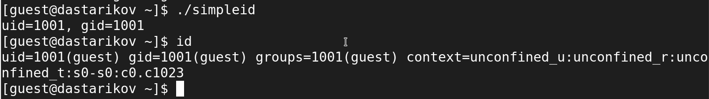{#fig:1 width=70%}


6. Усложнили программу, добавив вывод действительных идентификаторов (Листинг [-@lst:simpleid2]):
```{#lst:simpleid2 .c caption="Текст программы simpleid2.c"}
#include<sys/types.h>
#include<unistd.h>
#include<stdio.h>

int main(){
    uid_t real_uid = getuid();
    uid_t e_uid = geteuid();
    gid_t real_gid = getgid();
    gid_t e_gid = getegid() ;
    printf("e_uid=%d, e_gid=%d\n", e_uid, e_gid);
    printf("real_uid=%d, real_gid=%d\n", real_uid, real_gid);
    return 0;
}
```
Подробнее об отличиях `geteuid`, `getuid`, `getegid` и `getgid` можно прочитать в разделе 10.7 [@tanenbaum_book_modern-os_ru].

7. Скомпилировали и запустили `simpleid2.c`:
```
gcc simpleid2.c -o simpleid2
./simpleid2
```
8. Получили права суперпользователя и выполнили команды (Рис. [-@fig:2]):
```
su -
chown root:guest /home/guest/simpleid2
chmod u+s /home/guest/simpleid2
```
9. Выполнили проверку правильности установки новых атрибутов и смены владельца файла `simpleid2` (Рис. [-@fig:2]):
```
ls -l simpleid2
```

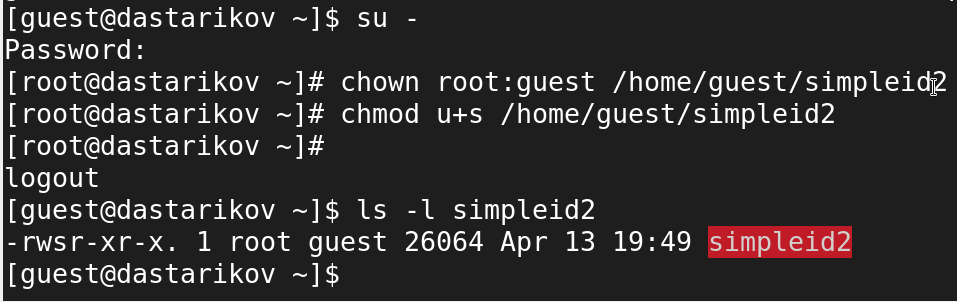{#fig:2 width=70%}

10. Запустили `simpleid2` и `id` (Рис. [-@fig:3]):
```
./simpleid2
id
```

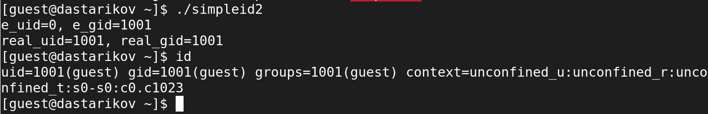{#fig:3 width=70%}

11. Проделайте тоже самое относительно SGID-бита (Рис. [-@fig:4]):
```
su -
chown root:root /home/guest/simpleid2
chmod u-s /home/guest/simpleid2
chmod g+s /home/guest/simpleid2
ls -l simpleid2
```

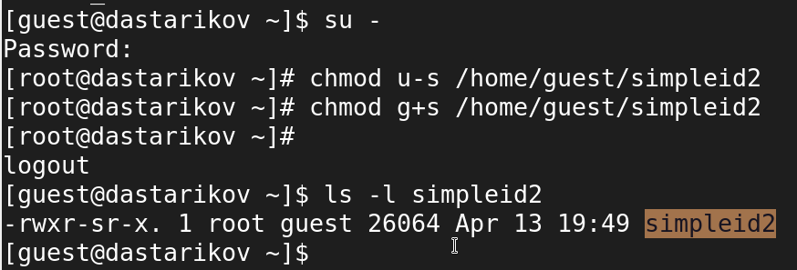{#fig:4 width=70%}

12. Запустили `simpleid2` и `id` (Рис. [-@fig:5]):
```
./simpleid2
id
```

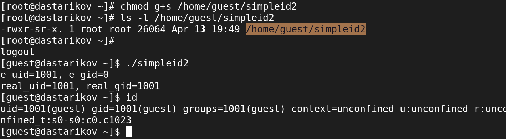{#fig:5 width=70%}

13. Создали программу `readfile.c` (Листинг [-@lst:simpleid2]): 
```{#lst:readfile .c caption="Текст программы readfile.c"}
#include<fcntl.h>
#include<stdio.h>
#include<sys/stat.h>
#include<sys/types.h>
#include<unistd.h>

int main(int argc, char* argv[]){
    unsigned char buffer[16];
    size_t bytes_read;
    int i;
    int fd = open(argv[1], O_RDONLY);
    do{
	    bytes_read = read(fd, buffer, sizeof (buffer));
	    for (i=0;i<bytes_read;++i) printf("%c", buffer[i]);
    } while (bytes_read == sizeof(buffer));
    close(fd);
    return 0;
}
```
14. Откомпилировали её.
```
gcc readfile.c -o readfile
```
15. Сменили владельца у файла `readfile.c` на `root` и изменили права так, чтобы только суперпользователь мог прочитать его, a `guest` не мог (Рис. [-@fig:6]).
16. Проверили, что пользователь `guest` не может прочитать файл `readfile.c` (Рис. [-@fig:5]).

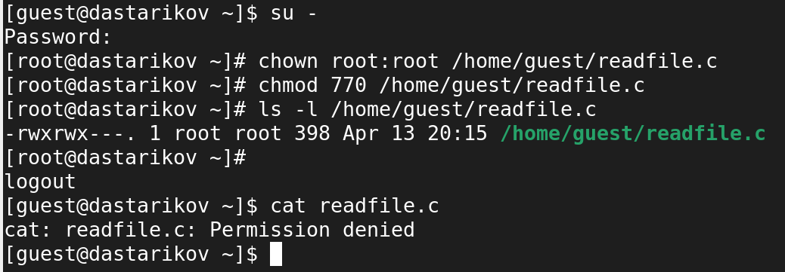{#fig:6 width=70%}

17. Сменили у программы `readfile` владельца и установите SetUID-бит (Рис. [-@fig:7]).
18. Проверили, что программа `readfile` прочитать файл `readfile.c` (Рис. [-@fig:7]):

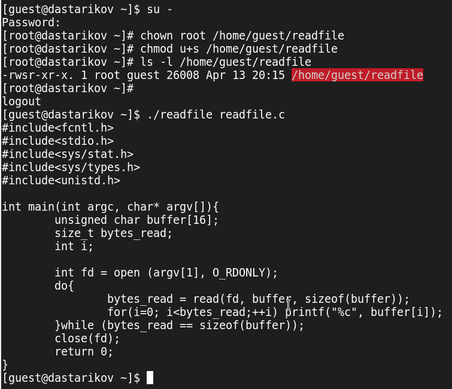{#fig:7 width=70%}

19. Проверили, что программа `readfile` прочитать файл `/etc/shadow` (Рис. [-@fig:8])?

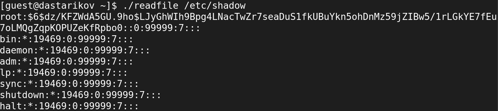{#fig:8 width=70%}

## Исследование Sticky-бита

1. Выяснили, что установлен атрибут `Sticky` на директории `/tmp` (Рис. [-@fig:9]), выполнив команду
```
ls -l / | grep tmp
```

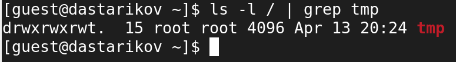{#fig:9 width=70%}

2. От имени пользователя `guest` создали файл `file01.txt` в директории `/tmp` со словом `test` (Рис. [-@fig:10]):
```
echo "test" > /tmp/file01.txt
```
3. Просмотрели атрибуты у только что созданного файла и разрешили чтение и запись для категории пользователей «все остальные» (Рис. [-@fig:10]):
```
ls -l /tmp/file01.txt
chmod o+rw /tmp/file01.txt
ls -l /tmp/file01.txt
```

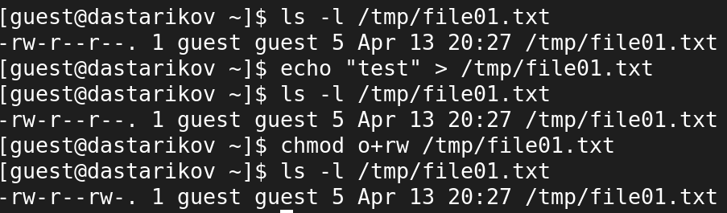{#fig:10 width=70%}


4. От пользователя `guest2` (не являющегося владельцем) попробовали прочитать файл `/tmp/file01.txt` (Рис. [-@fig:11]):
```
su guest2
cat /tmp/file01.txt
```
5. От пользователя `guest2` попробовали дозаписать в файл `/tmp/file01.txt` слово `test2` командой (Рис. [-@fig:11])
```
echo "test2" >> /tmp/file01.txt
```

6. Проверили содержимое файла командой (Рис. [-@fig:11])
```
cat /tmp/file01.txt
```
7. От пользователя `guest2` попробовали записать в файл `/tmp/file01.txt` слово `test3`, стерев при этом всю имеющуюся в файле информацию командой (Рис. [-@fig:11])
```
echo "test3" > /tmp/file01.txt
```

8. Проверили содержимое файла командой
```
cat /tmp/file01.txt
```
9. От пользователя `guest2` попробуйте удалить файл `/tmp/file01.txt` командой
```
rm /tmp/fileOl.txt
```

При установленном атрибутом `Sticky` все вышеперечисленные операции запрещены.

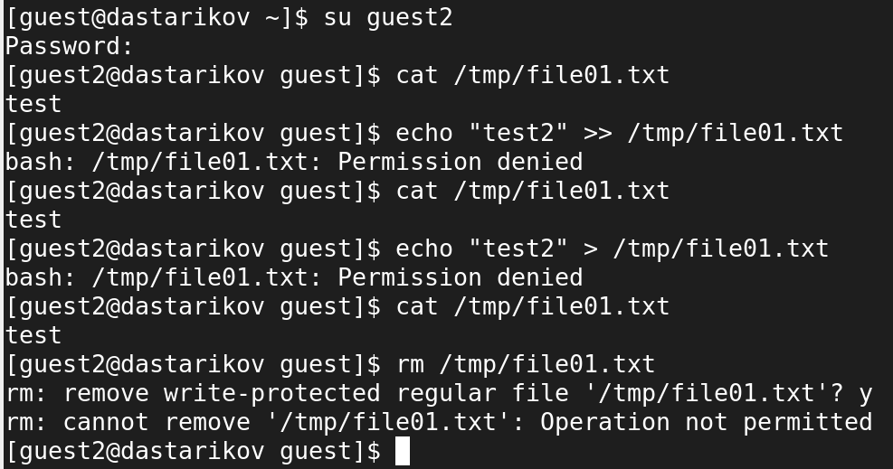{#fig:11 width=70%}

10. Повысили свои права до суперпользователя следующей командой
```
su -
```
и выполнили после этого команду, снимающую атрибут `t` (Sticky-бит) с директории `/tmp` (Рис. [-@fig:12]):
```
chmod -t /tmp
```

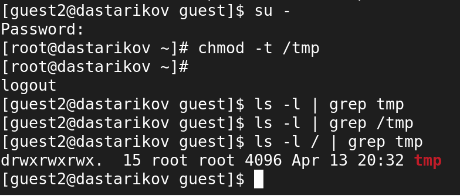{#fig:12 width=70%}

11. Покинули режим суперпользователя комбинацией `Ctrl+D`.
12. От пользователя `guest2` проверили, что атрибута `t` у директории `/tmp` нет (Рис. [-@fig:12]):
```
ls -l / | grep tmp
```
13. Повторили предыдущие шаги. После снятия Sticky-бита с файла мы также не могли записывать и перезаписывать данные файла, но смогли его удалить (Рис. [-@fig:13]).

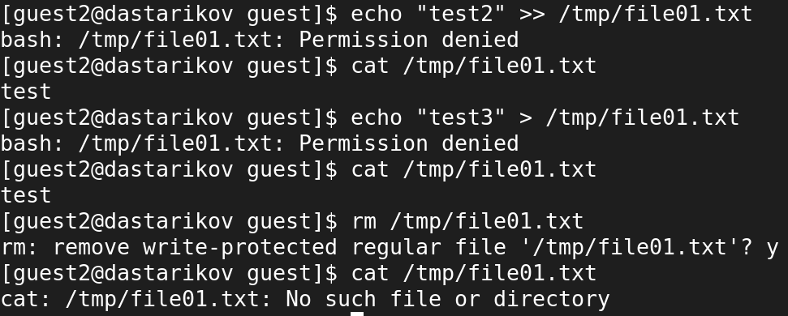{#fig:13 width=70%}

15. Повысили свои права до суперпользователя и верните атрибут `t` на директорию `/tmp`:
```
su -
chmod +t /tmp
exit
```

# Вывод

В рамках лабораторной работы изучили механизмы изменения идентификаторов, применения SetUID- и Sticky-битов, Получили практические навыкы работы в консоли с дополнительными атрибутами. Рассмотрели работы механизма смены идентификатора процессов пользователей, а также влияние бита Sticky на запись и удаление файлов.

# Список литературы{.unnumbered}
	
::: {#refs}
:::
