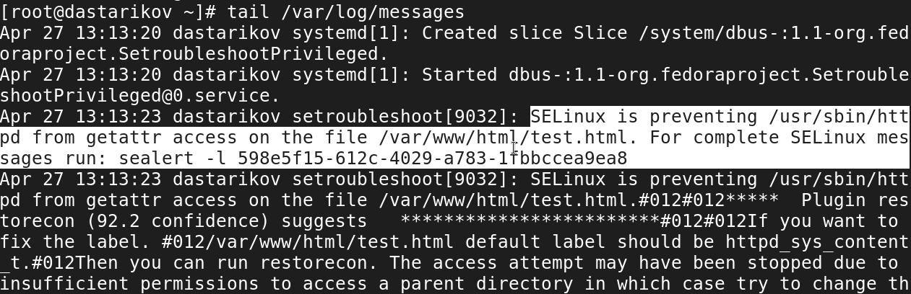

---
## Front matter
lang: ru-RU
title: "Лабораторная работа №6."
subtitle: "Мандатное разграничение прав в Linux"
author: "Стариков Данила Андреевич"

date: 27 апреля 2024

## i18n babel
babel-lang: russian
babel-otherlangs: english

## Formatting pdf
toc: false
toc-title: Содержание
slide_level: 2
aspectratio: 169
section-titles: true
theme: metropolis
header-includes:
 - \metroset{progressbar=frametitle,sectionpage=progressbar,numbering=fraction}
 - '\makeatletter'
 - '\beamer@ignorenonframefalse'
 - '\makeatother'
---

# Цели и задачи

- Развить навыки администрирования ОС Linux. 
- Получить первое практическое знакомство с технологией SELinux. 
- Проверить работу SELinx на практике совместно с веб-сервером Apache.

# Выполнение

## Выполнение

{#fig:1 width=70%}

## Выполнение

{#fig:2 width=70%}

## Выполнение

{#fig:3 width=70%}

## Выполнение

{#fig:4 width=50%}

## Выполнение

{#fig:5 width=50%}

## Выполнение

{#fig:6 width=70%}

## Выполнение

{#fig:7 width=70%}

## Выполнение

{#fig:8 width=70%}

## Выполнение

{#fig:9 width=70%}

## Выполнение

{#fig:10 width=70%}

## Выполнение

{#fig:12 width=70%}

## Выполнение

{#fig:13 width=70%}

## Выполнение

{#fig:14 width=70%}

## Выполнение

{#fig:15 width=70%}

## Выполнение

{#fig:16 width=70%}

## Выполнение

{#fig:17 width=70%}

## Выполнение

{#fig:18 width=70%}

## Выполнение

{#fig:19 width=70%}

## Выполнение

{#fig:21 width=70%}

## Выполнение

{#fig:20 width=70%}

# Итог

- В рамках лабораторной работы развили навыки администрирования ОС Linux, получили первое практическое знакомство с технологией SELinux и проверили работу SELinux на практике совместно с веб-сервером Apache.

