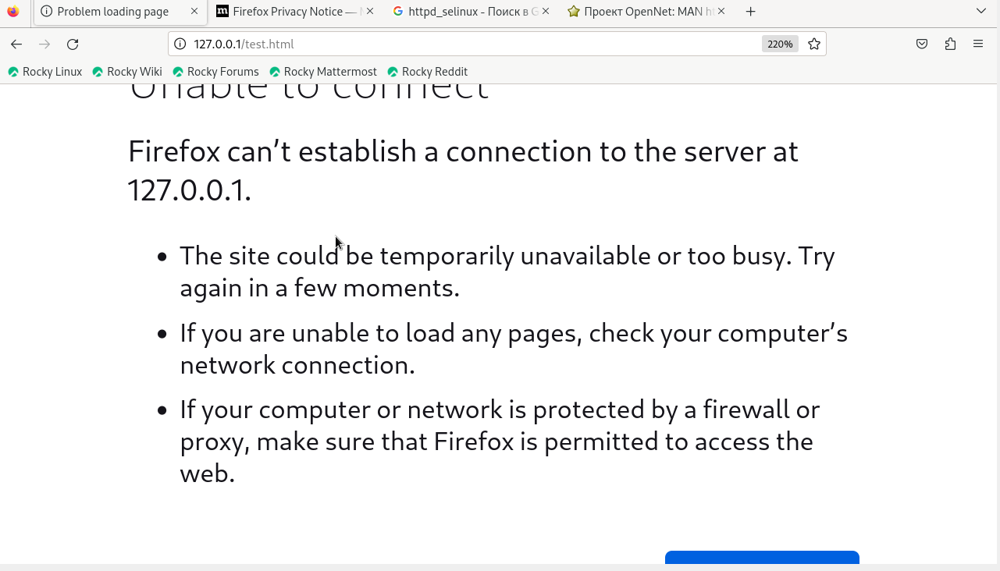

---
## Front matter
title: "Лабораторная работа №6."
subtitle: "Мандатное разграничение прав в Linux"
author: "Стариков Данила Андреевич"

## Generic otions
lang: ru-RU
toc-title: "Содержание"

## Bibliography
bibliography: bib/cite.bib
csl: pandoc/csl/gost-r-7-0-5-2008-numeric.csl

## Pdf output format
toc: true # Table of contents
toc-depth: 2
lof: false # List of figures
lot: false # List of tables
fontsize: 12pt
linestretch: 1.5
papersize: a4
documentclass: scrreprt
## I18n polyglossia
polyglossia-lang:
  name: russian
  options:
	- spelling=modern
	- babelshorthands=true
polyglossia-otherlangs:
  name: english
## I18n babel
babel-lang: russian
babel-otherlangs: english
## Fonts
mainfont: PT Serif
romanfont: PT Serif
sansfont: PT Sans
monofont: PT Mono
mainfontoptions: Ligatures=TeX
romanfontoptions: Ligatures=TeX
sansfontoptions: Ligatures=TeX,Scale=MatchLowercase
monofontoptions: Scale=MatchLowercase,Scale=0.9
## Biblatex
biblatex: true
biblio-style: "gost-numeric"
biblatexoptions:
  - parentracker=true
  - backend=biber
  - hyperref=auto
  - language=auto
  - autolang=other*
  - citestyle=gost-numeric
## Pandoc-crossref LaTeX customization
figureTitle: "Рис."
tableTitle: "Таблица"
listingTitle: "Листинг"
lofTitle: "Список иллюстраций"
lotTitle: "Список таблиц"
lolTitle: "Листинги"
## Misc options
indent: true
header-includes:
  - \usepackage{indentfirst}
  - \usepackage{float} # keep figures where there are in the text
  - \floatplacement{figure}{H} # keep figures where there are in the text
---

# Цель работы

Развить навыки администрирования ОС Linux. Получить первое практическое знакомство с технологией SELinux. Проверить работу SELinx на практике совместно с веб-сервером Apache.

# Выполнение лабораторной работы

1. Вошли в систему с полученными учётными данными и убедитесь, что SELinux работает в режиме enforcing политики targeted с помощью команд `getenforce` и `sestatus` (Рис. [-@fig:1]).

{#fig:1 width=70%}

2. Обратились с помощью браузера к веб-серверу, запущенному на компьютере, и убедились, что последний работает (Рис. [-@fig:2]):

```
service httpd status
```

{#fig:2 width=70%}

3. Нашли веб-сервер Apache в списке процессов, определили его контекст безопасности (Рис. [-@fig:3])

```
ps auxZ | grep httpd
```

{#fig:3 width=70%}

4. Посмотрели текущее состояние переключателей SELinux для Apache с помощью команды (Рис. [-@fig:4])
```
sestatus -b httpd
```
Обратили внимание, что многие из них находятся в положении «off».

{#fig:4 width=70%}

5. Посмотрели статистику по политике с помощью команды `seinfo`, также определили множество пользователей, ролей, типов (Рис. [-@fig:5]). 
Пользователей -- 8, ролей -- 15, типов -- 5135.

{#fig:5 width=70%}


6. Определили тип файлов и поддиректорий, находящихся в директории `/var/www`, с помощью команды (Рис. [-@fig:6])

```
ls -lZ /var/www
```

{#fig:6 width=70%}

7. Определили тип файлов, находящихся в директории `/var/www/html` (Рис. [-@fig:7]):

```
ls -lZ /var/www/html
```

{#fig:7 width=70%}

8. Определили круг пользователей, которым разрешено создание файлов в директории `/var/www/html`.
Только пользователи `root` имеют право создавать файлы в директории `/var/www/html`.

9. Создали от имени суперпользователя html-файл `/var/www/html/test.html` следующего содержания (Рис. [-@fig:8]):

```html
<html>
<body>test</body>
</html>
```

{#fig:8 width=70%}

10. Проверили контекст созданного вами файла. По умолчанию файлам присваивается контекст `unconfined_u:object_u:httpd_sys_content_t:s0` (Рис. [-@fig:9]).

{#fig:9 width=70%}

11. Обратились к файлу через веб-сервер, введя в браузере адрес `http://127.0.0.1/test.html`. Убедились, что файл был успешно отображён.

{#fig:10 width=70%}

12. Изучили справку man httpd_selinux и выяснили, какие контексты файлов определены для `httpd`. Сопоставили их с типом файла `test.html` (Рис. [-@fig:9]).
```
ls -Z /var/www/html/test.html
```


13. Изменили контекст файла `/var/www/html/test.html` с `httpd_sys_content_t` на `samba_share_t`(Рис. [-@fig:12]):

```
chcon -t samba_share_t /var/www/html/test.html
ls -Z /var/www/html/test.html 
```

{#fig:12 width=70%}

14. Попробовали ещё раз получить доступ к файлу через веб-сервер, введя в браузере адрес `http://127.0.0.1/test.html`. Получили сообщение об ошибке (Рис. [-@fig:13]):
```
Forbidden
You don't have permission to access /test.html on this server.
```

{#fig:13 width=70%}

15. Проанализировали ситуацию. Почему файл не был отображён, если права доступа позволяют читать этот файл любому пользователю?
```
ls -l /var/www/html/test.html
```
Просмотрите log-файлы веб-сервера Apache. Также просмотрите системный лог-файл Рис. [-@fig:14]):
```
tail /var/log/messages
```

{#fig:14 width=70%}

SELinux отказывает в доступе к файлу, так как нет соответствующего контекста безопасности.

16. Попробовали запустить веб-сервер Apache на прослушивание ТСР-порта 81. Для этого в файле `/etc/httpd/httpd.conf` найдите строчку `Listen 80` и замените её на `Listen 81`. 

17. Выполнили перезапуск веб-сервера Apache. Произошёл сбой (Рис. [-@fig:15]).

{#fig:15 width=70%}

18. Проанализировали лог-файлы (Рис. [-@fig:16] - [-@fig:18]):
```
tail -nl /var/log/messages
```
Просмотрели файлы `/var/log/http/error_log`, `/var/log/http/access_log` и `/var/log/audit/audit.log` и выяснили, в каких файлах появились записи.

{#fig:16 width=70%}

{#fig:17 width=70%}

{#fig:18 width=70%}

19. Выполнили команду (Рис. [-@fig:19])
```
semanage port -a -t http_port_t -р tcp 81
```
После этого проверили список портов командой 
```
semanage port -l | grep http_port_t
```
Убедились, что порт 81 появился в списке.

{#fig:19 width=70%}

20. Вернули контекст `httpd_sys_cоntent_t` к файлу `/var/www/html/test.html` (Рис. [-@fig:21]):
```
chcon -t httpd_sys_content_t /var/www/html/test.html
```

{#fig:21 width=70%}

После этого попробуйте получить доступ к файлу через веб-сервер, введя в браузере адрес `http://127.0.0.1:81/test.html`. Вы должны увидеть содержимое файла — слово «test» (Рис. [-@fig:20]).

{#fig:20 width=70%}

21. Исправили обратно конфигурационный файл apache, вернув `Listen 80`.

22. Удалили файл `/var/www/html/test.html`:
```
rm /var/www/html/test.html
```

Более подробно о SELinux можно прочитать в книге [@selinux].

# Выводы

В рамках лабораторной работы развили навыки администрирования ОС Linux, получили первое практическое знакомство с технологией SELinux и проверили работу SELinux на практике совместно с веб-сервером Apache.

# Список литературы{.unnumbered}

::: {#refs}
:::
