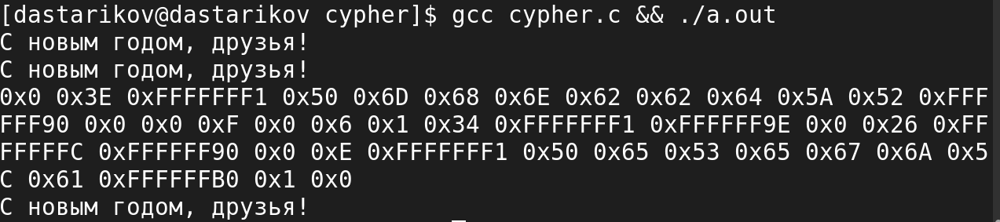

---
## Front matter
lang: ru-RU
title: "Лабораторная работа №7."
subtitle: "Элементы криптографии. Однократное гаммирование"
author: "Стариков Данила Андреевич"

date: 11 мая 2024

## i18n babel
babel-lang: russian
babel-otherlangs: english

## Formatting pdf
toc: false
toc-title: Содержание
slide_level: 2
aspectratio: 169
section-titles: true
theme: metropolis
header-includes:
 - \metroset{progressbar=frametitle,sectionpage=progressbar,numbering=fraction}
 - '\makeatletter'
 - '\beamer@ignorenonframefalse'
 - '\makeatother'
---

# Цели и задачи

- Освоить на практике применение режима однократного гаммирования.


# Выполнение

## Листинг

```c
void initKey(char key[], int size) {
    for(int i=0; i<size; i++)
        key[i] = 0x00;
    key[size-1] = '\0';
}
void printKey(char key[], int size) {
    for(int i=0; i<size; i++)
        printf("0x%X ", key[i]);
    printf("\n");
}
```

## Листинг

```c
void xor(char out[], char str1[], char str2[], int size) {
    for(int i=0; i<size; i++)
        out[i] = str1[i] ^ str2[i];
    out[size-1] = '\0';
}
```

## Листинг

```c
int main() {
   char open[] = "С новым годом, друзья!";
   int size = sizeof(open)/sizeof(open[0]);
   char key[size];
   char test[size];
   char cyphered[] = "Привет, мир! Как дела?";
   printf("%s\n", open);
   
   initkey(key, size);
   xor(test, open, key, size);
   printf("%s\n", test);
```

## Листинг


```c
   char key2[size];
   xor(key2, open, cyphered, size);
   printKey(key2, size);
   xor(test, cyphered, key2, size);
   printf("%s\n", test);
   return 0;
}
```
## Выполнение

{#fig:1 width=70%}


# Итоги

- В результате лабораторной работы реализовали на языке Си программу, использующую однократное гаммирование для шифрования сообщения

