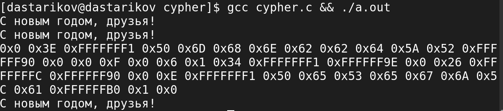

---
## Front matter
title: "Лабораторная работа №7."
subtitle: "Элементы криптографии. Однократное гаммирование"
author: "Стариков Данила Андреевич"

## Generic otions
lang: ru-RU
toc-title: "Содержание"

## Bibliography
bibliography: bib/cite.bib
csl: pandoc/csl/gost-r-7-0-5-2008-numeric.csl

## Pdf output format
toc: true # Table of contents
toc-depth: 2
lof: false # List of figures
lot: false # List of tables
fontsize: 12pt
linestretch: 1.5
papersize: a4
documentclass: scrreprt
## I18n polyglossia
polyglossia-lang:
  name: russian
  options:
	- spelling=modern
	- babelshorthands=true
polyglossia-otherlangs:
  name: english
## I18n babel
babel-lang: russian
babel-otherlangs: english
## Fonts
mainfont: PT Serif
romanfont: PT Serif
sansfont: PT Sans
monofont: PT Mono
mainfontoptions: Ligatures=TeX
romanfontoptions: Ligatures=TeX
sansfontoptions: Ligatures=TeX,Scale=MatchLowercase
monofontoptions: Scale=MatchLowercase,Scale=0.9
## Biblatex
biblatex: true
biblio-style: "gost-numeric"
biblatexoptions:
  - parentracker=true
  - backend=biber
  - hyperref=auto
  - language=auto
  - autolang=other*
  - citestyle=gost-numeric
## Pandoc-crossref LaTeX customization
figureTitle: "Рис."
tableTitle: "Таблица"
listingTitle: "Листинг"
lofTitle: "Список иллюстраций"
lotTitle: "Список таблиц"
lolTitle: "Листинги"
## Misc options
indent: true
header-includes:
  - \usepackage{indentfirst}
  - \usepackage{float} # keep figures where there are in the text
  - \floatplacement{figure}{H} # keep figures where there are in the text
---

# Цель работы

Освоить на практике применение режима однократного гаммирования.


# Выполнение лабораторной работы

Для выполнения задания был выбран язык Си. Текст программы можно посмореть на Листинге [-@fig:1].

```{#lst:code .c caption="Программа cypher.c"}
void initKey(char key[], int size) {
    for(int i=0; i<size; i++)
        key[i] = 0x00;
    key[size-1] = '\0';
}
void printKey(char key[], int size) {
    for(int i=0; i<size; i++)
        printf("0x%X ", key[i]);
    printf("\n");
}
void xor(char out[], char str1[], char str2[], int size) {
    for(int i=0; i<size; i++)
        out[i] = str1[i] ^ str2[i];
    out[size-1] = '\0';
}
int main() {
   char open[] = "С новым годом, друзья!";
   int size = sizeof(open)/sizeof(open[0]);
   char key[size];
   char test[size];
   char cyphered[] = "Привет, мир! Как дела?";
   printf("%s\n", open);
   
   initkey(key, size);
   xor(test, open, key, size);
   printf("%s\n", test);
   
   char key2[size];
   xor(key2, open, cyphered, size);
   printKey(key2, size);
   xor(test, cyphered, key2, size);
   printf("%s\n", test);
   return 0;
}
```

При выполнении получаем соответвующий вывод (рис. [-@fig:1]):

{#fig:1 width=70%}

# Выводы
В результате лабораторной работы реализовали на языке Си программу, использующую однократное гаммирование для шифрования сообщения [@shannon].

# Список литературы{.unnumbered}

::: {#refs}
:::
