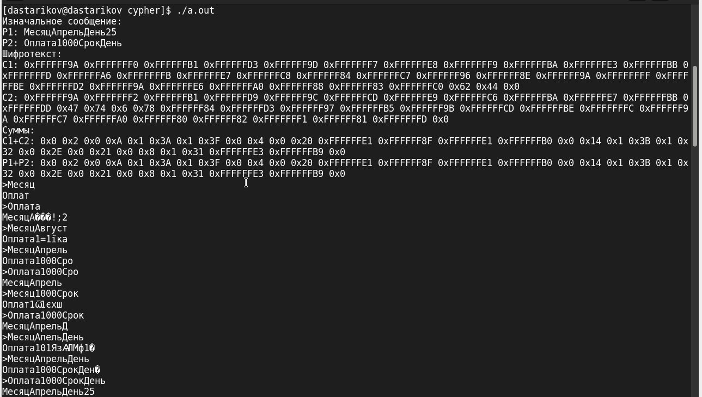

---
## Front matter
lang: ru-RU
title: "Лабораторная работа №8."
subtitle: "Элементы криптографии. Шифрование (кодирование) различных исходных текстов одним ключом"
author: "Стариков Данила Андреевич"

date: 25 мая 2024

## i18n babel
babel-lang: russian
babel-otherlangs: english

## Formatting pdf
toc: false
toc-title: Содержание
slide_level: 2
aspectratio: 169
section-titles: true
theme: metropolis
header-includes:
 - \metroset{progressbar=frametitle,sectionpage=progressbar,numbering=fraction}
 - '\makeatletter'
 - '\beamer@ignorenonframefalse'
 - '\makeatother'
---

# Цели и задачи

- Освоить на практике применение режима однократного гаммирования на примере кодирования различных исходных текстов одним ключом.

# Выполнение

## Листинг

```c
void setKey(char key[], int size) {
    const char charset[] = "abcdefghijklmnopqrstuvwxyz \
                            ABCDEFGHIJKLMNOPQRSTUVWXYZ0123456789";
    size_t charset_size = sizeof(charset) - 1;

    srand(time(NULL));

    for (int i = 0; i < size; ++i) {
        int index = rand() % charset_size;
        key[i] = charset[index];
    }
    key[size-1] = '\0'; // Null-terminate the string
}
```
## Листинг

```c
int main() {
    char P1[] = "МесяцАпрельДень25";
    char P2[] = "Оплата1000СрокДень";
    int msgSize = sizeof(P1)/sizeof(P1[0]);
    char testKey[msgSize];
    setKey(testKey, msgSize);
    char C1[msgSize];
    char C2[msgSize];
    xor(C1, P1, testKey, msgSize);
    xor(C2, P2, testKey, msgSize);
    printf("Изначальное сообщение: \n");
    printf("%s\n", P1);
    printf("%s\n", P2);

```

## Листинг

```c
    printf("Шифротексты: \n");
    printKey(C1, msgSize);
    printKey(C2, msgSize);

    printf("Сравнение C1+C2 и P1+P2: \n");
    char C12[msgSize];
    char P12[msgSize];
    xor(C12, C1, C2, msgSize);
    xor(P12, P1, P2, msgSize);
    printKey(C12, msgSize);
    printKey(P12, msgSize);
```

## Листинг

```c
    char input[msgSize];
    char output[msgSize];
    while (1) {
        printf(">");
        scanf("%s", &input);
        xor(output, input, C12, msgSize);
        printf("%s\n", output);
    }
    return 0;
}
```
## Выполнение

{#fig:1 width=80%}


# Итоги

- Реализовали на языке Си программу, использующую однократное гаммирование для шифрования сообщения, проверили на практике систему кодирования двух сообщений одним ключом.

