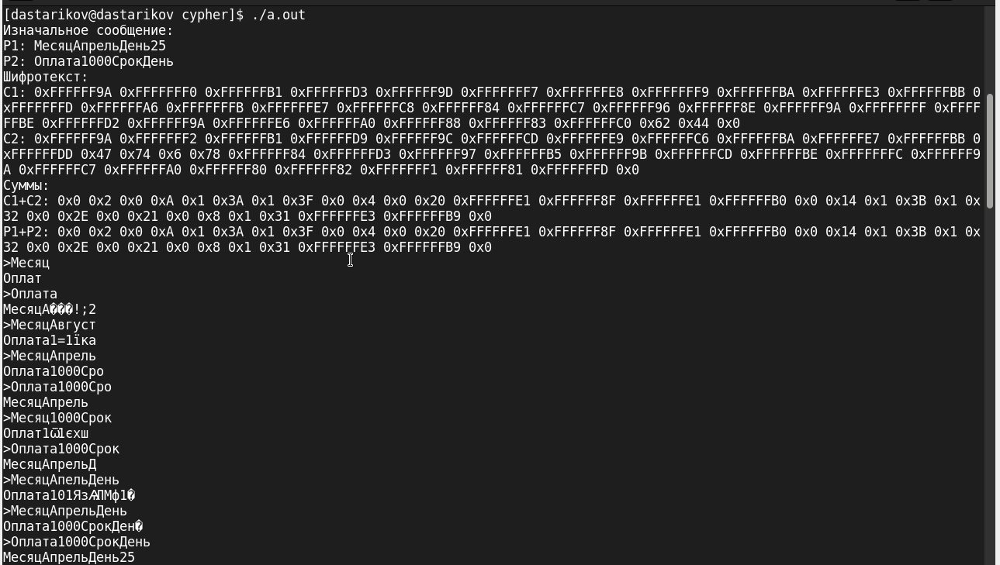

---
## Front matter
title: "Лабораторная работа №8."
subtitle: "Элементы криптографии. Шифрование (кодирование) различных исходных текстов одним ключом"
author: "Стариков Данила Андреевич"

## Generic otions
lang: ru-RU
toc-title: "Содержание"

## Bibliography
bibliography: bib/cite.bib
csl: pandoc/csl/gost-r-7-0-5-2008-numeric.csl

## Pdf output format
toc: true # Table of contents
toc-depth: 2
lof: false # List of figures
lot: false # List of tables
fontsize: 12pt
linestretch: 1.5
papersize: a4
documentclass: scrreprt
## I18n polyglossia
polyglossia-lang:
  name: russian
  options:
	- spelling=modern
	- babelshorthands=true
polyglossia-otherlangs:
  name: english
## I18n babel
babel-lang: russian
babel-otherlangs: english
## Fonts
mainfont: PT Serif
romanfont: PT Serif
sansfont: PT Sans
monofont: PT Mono
mainfontoptions: Ligatures=TeX
romanfontoptions: Ligatures=TeX
sansfontoptions: Ligatures=TeX,Scale=MatchLowercase
monofontoptions: Scale=MatchLowercase,Scale=0.9
## Biblatex
biblatex: true
biblio-style: "gost-numeric"
biblatexoptions:
  - parentracker=true
  - backend=biber
  - hyperref=auto
  - language=auto
  - autolang=other*
  - citestyle=gost-numeric
## Pandoc-crossref LaTeX customization
figureTitle: "Рис."
tableTitle: "Таблица"
listingTitle: "Листинг"
lofTitle: "Список иллюстраций"
lotTitle: "Список таблиц"
lolTitle: "Листинги"
## Misc options
indent: true
header-includes:
  - \usepackage{indentfirst}
  - \usepackage{float} # keep figures where there are in the text
  - \floatplacement{figure}{H} # keep figures where there are in the text
---

# Цель работы

Освоить на практике применение режима однократного гаммирования на примере кодирования различных исходных текстов одним ключом


# Выполнение лабораторной работы

Для выполнения задания был выбран язык Си.. Функции `xor` и `printKey` взяты из лабораторной работы №7, отдельно была написана функция `setKey`, которая генерирует случайный ключ заданного размера (Листинг [-@lst:setKey]). Текст программы можно посмотреть на Листинге [-@lst:code].

```{#lst:setKey .c caption="Функция setKey"}
void setKey(char key[], int size) {
    const char charset[] = "abcdefghijklmnopqrstuvwxyz \
                            ABCDEFGHIJKLMNOPQRSTUVWXYZ0123456789";
    size_t charset_size = sizeof(charset) - 1;

    srand(time(NULL));

    for (int i = 0; i < size; ++i) {
        int index = rand() % charset_size;
        key[i] = charset[index];
    }
    key[size-1] = '\0'; // Null-terminate the string
}
```

```{#lst:code .c caption="Программа cypher1.c"}
#include<stdio.h>
#include<time.h>
#include<stdlib.h>

int main() {
    char P1[] = "МесяцАпрельДень25";
    char P2[] = "Оплата1000СрокДень";
    int msgSize = sizeof(P1)/sizeof(P1[0]);
    char testKey[msgSize];
    setKey(testKey, msgSize);
    char C1[msgSize];
    char C2[msgSize];
    xor(C1, P1, testKey, msgSize);
    xor(C2, P2, testKey, msgSize);
    printf("Изначальное сообщение: \n");
    printf("%s\n", P1);
    printf("%s\n", P2);

    printf("Шифротексты: \n");
    printKey(C1, msgSize);
    printKey(C2, msgSize);

    printf("Сравнение C1+C2 и P1+P2: \n");
    char C12[msgSize];
    char P12[msgSize];
    xor(C12, C1, C2, msgSize);
    xor(P12, P1, P2, msgSize);
    printKey(C12, msgSize);
    printKey(P12, msgSize);
    char input[msgSize];
    char output[msgSize];
    while (1) {
        printf(">");
        scanf("%s", &input);
        xor(output, input, C12, msgSize);
        printf("%s\n", output);
    }
    return 0;

}
```

При выполнении получаем соответвующий вывод (рис. [-@fig:1]):

{#fig:1 width=70%}

# Выводы
В результате лабораторной работы реализовали на языке Си программу, использующую однократное гаммирование для шифрования сообщения, проверили на практике систему кодирования двух сообщений одним ключом [@shannon].

# Список литературы{.unnumbered}

::: {#refs}
:::
