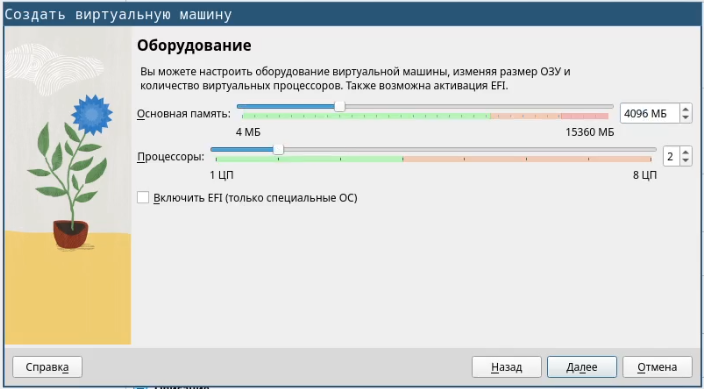
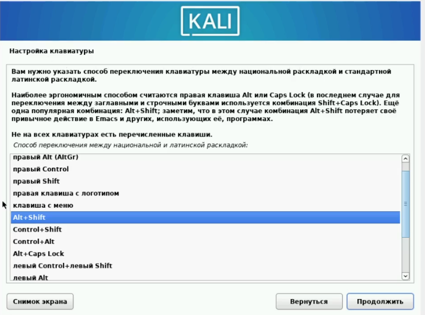
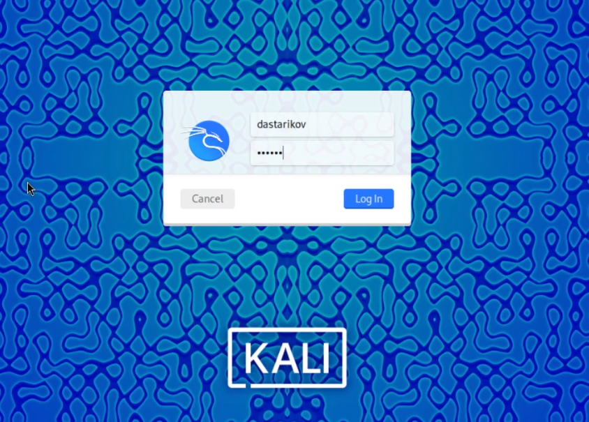

---
## Front matter
title: "Индивидуальный проект. Этап 1. Установка дистрибутива Kali Linux"
author: "Стариков Данила Андреевич"

## Generic otions
lang: ru-RU
toc-title: "Содержание"

## Bibliography
bibliography: bib/cite.bib
csl: pandoc/csl/gost-r-7-0-5-2008-numeric.csl

## Pdf output format
toc: true # Table of contents
toc-depth: 2

fontsize: 12pt
linestretch: 1.5
papersize: a4
documentclass: scrreprt
## I18n polyglossia
polyglossia-lang:
  name: russian
  options:
	- spelling=modern
	- babelshorthands=true
polyglossia-otherlangs:
  name: english
## I18n babel
babel-lang: russian
babel-otherlangs: english
## Fonts
mainfont: PT Serif
romanfont: PT Serif
sansfont: PT Sans
monofont: PT Mono
mainfontoptions: Ligatures=TeX
romanfontoptions: Ligatures=TeX
sansfontoptions: Ligatures=TeX,Scale=MatchLowercase
monofontoptions: Scale=MatchLowercase,Scale=0.9
## Biblatex
biblatex: true
biblio-style: "gost-numeric"
biblatexoptions:
  - parentracker=true
  - backend=biber
  - hyperref=auto
  - language=auto
  - autolang=other*
  - citestyle=gost-numeric
## Pandoc-crossref LaTeX customization
figureTitle: "Рис."
tableTitle: "Таблица"
listingTitle: "Листинг"
lofTitle: "Список иллюстраций"
lotTitle: "Список таблиц"
lolTitle: "Листинги"
## Misc options
indent: true
header-includes:
  - \usepackage{indentfirst}
  - \usepackage{float} # keep figures where there are in the text
  - \floatplacement{figure}{H} # keep figures where there are in the text
---

# Цель работы

Установить и настроить дистрибутив Kali Linux как виртуальный машину в VirtualBox.

# Выполнение лабораторной работы

Перешли на официальный сайт и загрузили ISO-образ дистрибутива Kali Linux (https://www.kali.org/get-kali/), версия 2024.1. Затем открыли VirtualBox и начали процесс создания новой виртуальной машины (ВМ) (Рис. [-@fig:15]).

{#fig:15 width=70%}

Затем выделили для работы ВМ 4 Гб оперативной памяти и 2 ядра центрального процессора (Рис. [-@fig:14]), создан виртуальный жесткий диск на 25 Гб. Итоговые параметры ВМ показаны на Рисунке [-@fig:13].

{#fig:14 width=70%}

{#fig:13 width=70%}

Запустили ВМ и увидели окно установщика операционной системы (Рис. [-@fig:12]), выбрали графический интерфейс установки (Graphical Install). 

{#fig:12 width=70%}

Выбрали русский язык системы, настроили комбинацию Alt+Shift как переключение между раскалдками (Рис. [-@fig:11]).

{#fig:11 width=70%}

Установили имя сети в соответствии с соглашение об именовании (Рис. [-@fig:10]).

{#fig:10 width=70%}

Настроили учетную запись администратора и указали пароль (Рис. [-@fig:9] и [-@fig:7])

{#fig:9 width=70%}

{#fig:7 width=70%}

Дали прошли настройку разметки дисков (Рис. [-@fig:6] и [-@fig:5])

{#fig:6 width=70%}

{#fig:5 width=70%}

Затем установили предложенные пакеты утилит (Рис. [-@fig:4])

{#fig:4 width=70%}

После завершения установки ВМ самостояльтельно перезагрузилась, и мы вошли в систему (Рис. [-@fig:18]).

{#fig:18 width=70%}

Убедились, что система успешно установилась, еще раз перезагрузили систему и зашли в консоль (Рис. [-@fig:17]).

{#fig:17 width=70%}

# Выводы

В рамках Этапа №1 индивидуального проекта установили и настроили дистрибутив Kali Linux в VirtualBox.

