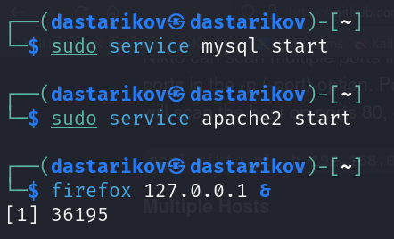
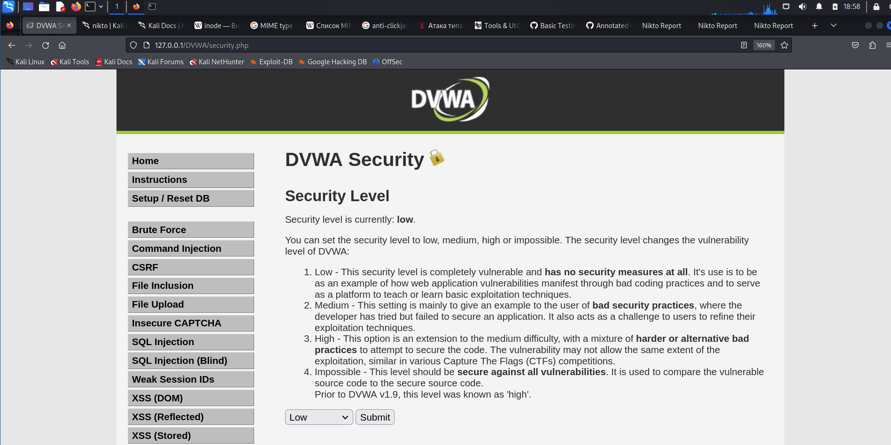
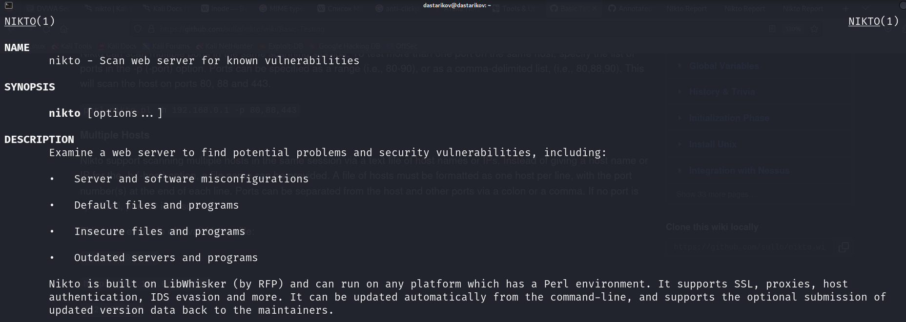
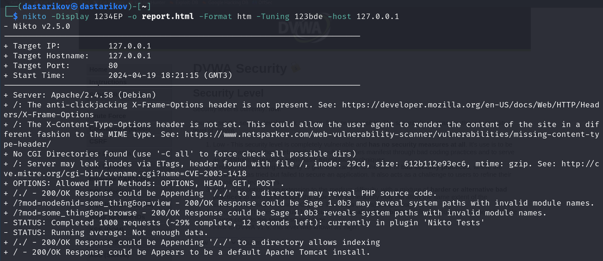
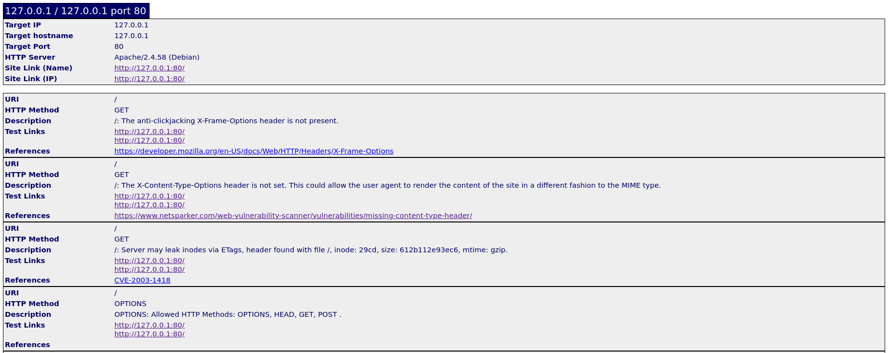
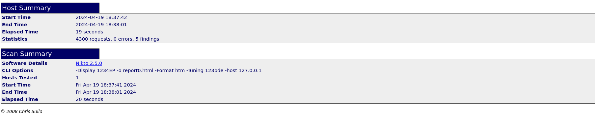
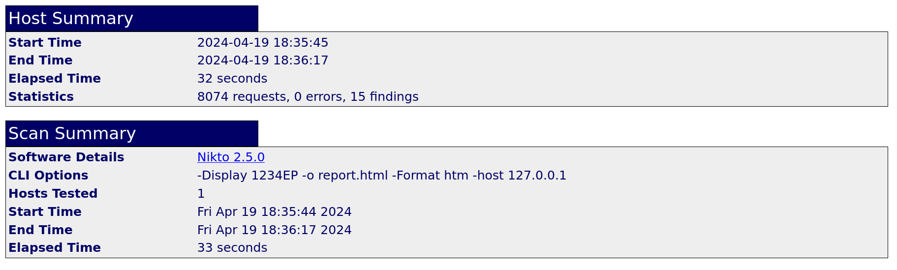

---
## Front matter
lang: ru-RU
title: "Индивидуальный проект."
subtitle: "Этап 4. Использование nikto"
author: "Стариков Данила Андреевич"
institute: "Российский университет дружбы народов имени Патриса Лумумбы, Москва, Россия"
date: 19 апреля 2024

## i18n babel
babel-lang: russian
babel-otherlangs: english

## Formatting pdf
toc: false
toc-title: Содержание
slide_level: 2
aspectratio: 169
section-titles: true
theme: metropolis
header-includes:
 - \metroset{progressbar=frametitle,sectionpage=progressbar,numbering=fraction}
 - '\makeatletter'
 - '\beamer@ignorenonframefalse'
 - '\makeatother'
---

# Цели и задачи 
- Познакомиться с утилитой nikto для поиска уязвимостей веб-серверов
- Проверить ее работу на ранее установленном сервере DVWA

# Результаты
## Результаты
{#fig:4 width=70%}

## Результаты

{#fig:6 width=70%}

## Результаты

{#fig:5 width=70%}

## Результаты

{#fig:7 width=70%}

## Результаты

{#fig:8 width=70%}

## Результаты

{#fig:9 width=70%}

## Результаты

{#fig:10 width=70%}

# Итог

- В результате работы познакомились с утилитой `nikto` и проверили уязвимости веб-сервера DVWA с разными параметрами теста.
