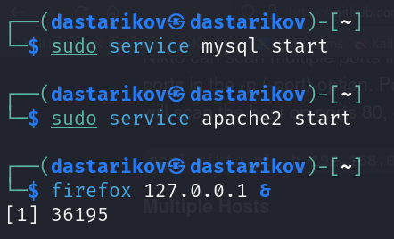
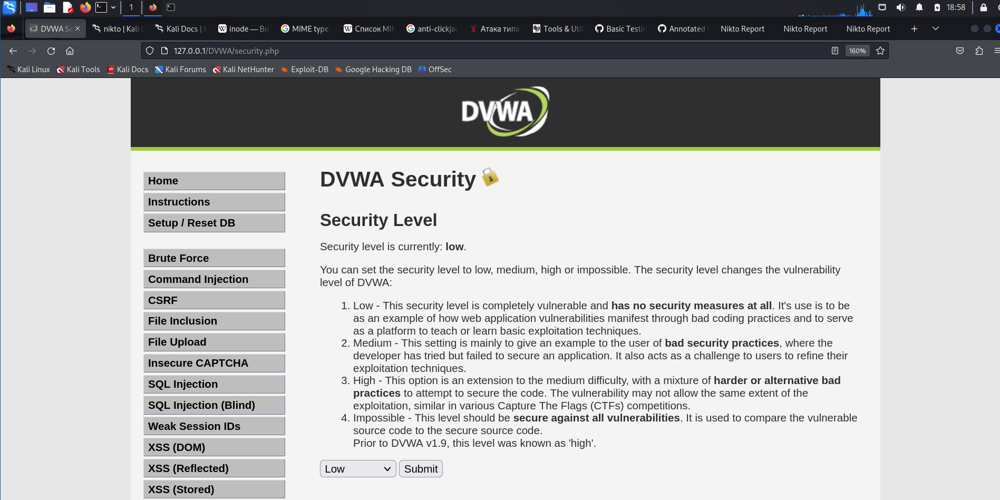
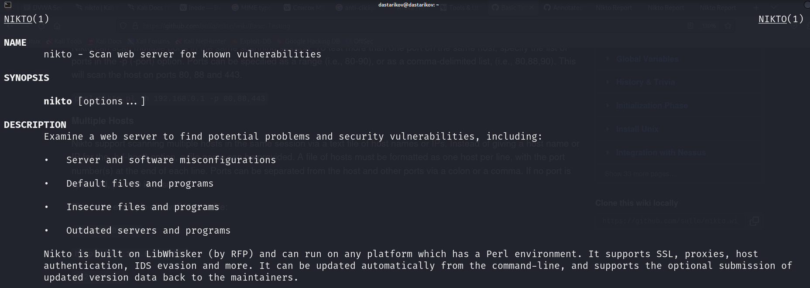
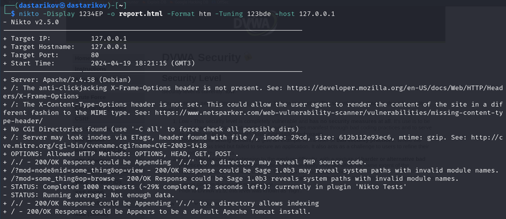
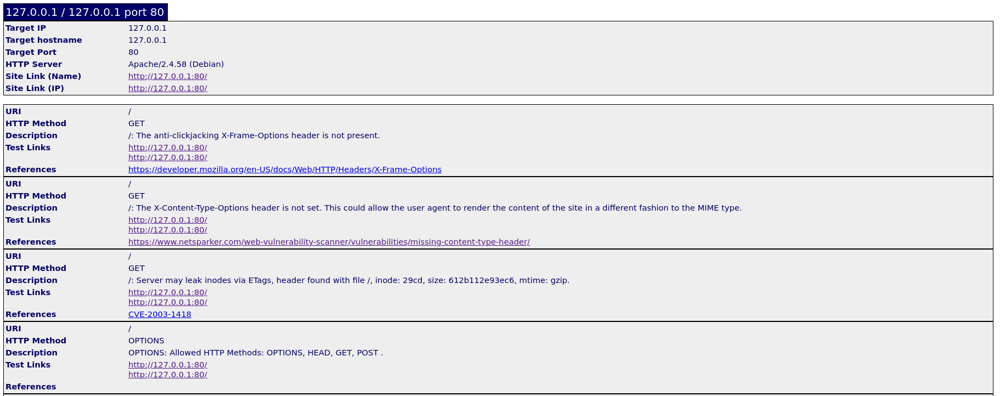
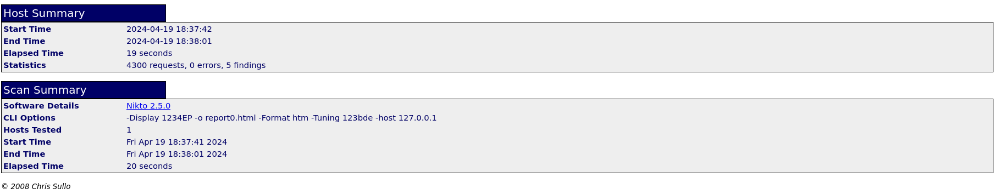
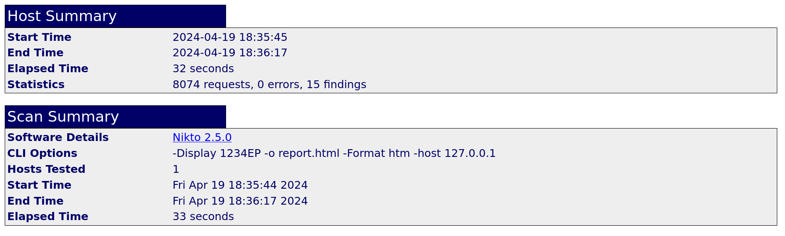

---
## Front matter
title: "Индивидуальный проект."
subtitle: "Этап 4. Использование nikto"
author: "Стариков Данила НПИбд-02-22"

## Generic otions
lang: ru-RU
toc-title: "Содержание"

## Bibliography
bibliography: bib/cite.bib
csl: pandoc/csl/gost-r-7-0-5-2008-numeric.csl

## Pdf output format
toc: true # Table of contents
toc-depth: 2
lof: false # List of figures
lot: false # List of tables
fontsize: 12pt
linestretch: 1.5
papersize: a4
documentclass: scrreprt
## I18n polyglossia
polyglossia-lang:
  name: russian
  options:
	- spelling=modern
	- babelshorthands=true
polyglossia-otherlangs:
  name: english
## I18n babel
babel-lang: russian
babel-otherlangs: english
## Fonts
mainfont: PT Serif
romanfont: PT Serif
sansfont: PT Sans
monofont: PT Mono
mainfontoptions: Ligatures=TeX
romanfontoptions: Ligatures=TeX
sansfontoptions: Ligatures=TeX,Scale=MatchLowercase
monofontoptions: Scale=MatchLowercase,Scale=0.9
## Biblatex
biblatex: true
biblio-style: "gost-numeric"
biblatexoptions:
  - parentracker=true
  - backend=biber
  - hyperref=auto
  - language=auto
  - autolang=other*
  - citestyle=gost-numeric
## Pandoc-crossref LaTeX customization
figureTitle: "Рис."
tableTitle: "Таблица"
listingTitle: "Листинг"
lofTitle: "Список иллюстраций"
lotTitle: "Список таблиц"
lolTitle: "Листинги"
## Misc options
indent: true
header-includes:
  - \usepackage{indentfirst}
  - \usepackage{float} # keep figures where there are in the text
  - \floatplacement{figure}{H} # keep figures where there are in the text
---

# Цель работы

Познакомиться с утилитой nikto для поиска уязвимостей веб-серверов, проверить ее работу на ранее установленном сервере DVWA.


# Теоретическое введение

`nikto` — базовый сканер безопасности веб-сервера. Он сканирует и обнаруживает уязвимости в веб-приложениях, обычно вызванные неправильной конфигурацией на самом сервере, файлами, установленными по умолчанию, и небезопасными файлами, а также устаревшими серверными приложениями.

Для запуска `nukto` в командной строке необходимо указать несколько параметров (Табл. [-@tbl:nikto-keys]):

: Основные параметры запуска `nikto` {#tbl:nikto-keys}

| Ключ 	| Описание ключа|
|---------------|------------------------------------------------------------------------------------------------------------------|
|-`host`	|Указание `IP`-адрес сервера, для которого необходимо выполнить проверку на уязвимости. Передав текстовый файл можно указать список адресов для проверки. |
|-`Display`	|Определение сообщения nikto будет выводить в консоль. Возможные значения:|
|		|`1` -- показывать перенаправления|
|		|`2` -- показывать полученные файлы cookie|
|		|`3` -- показывать все ответы 200/OK|
|		|`4` -- показывать URL-адреса, для которых требуется аутентификация|
|		|`D` -- вывод для отладки|
|		|`V` -- подробный вывод|
|		|`E` -- показывать все `HTTP` ошибки|
|		|`P` -- выводить прогресс в стандартный вывод (`STDOUT`)|
|-`Tuning`	|Контроль над тестами, которые `nikto` будет проводить. Возможные значения:|
|		|`1` --Интересный файл / Замеченный в логах|
|		|`2` --Неправильная настройка / Файл по умолчанию|
|		|`3` --Раскрытие информации|
|		|`4` --Внедрение (XSS/Script/HTML)|
|		|`5` --Удаленный поиск файлов - Внутри корневого веб-каталога|
|		|`6`-- Отказ в обслуживании|
|		|`7`-- Удаленный поиск файлов - на сервере|
|		|`8` --Выполнение команд / Удаленная оболочка|
|		|`9` --SQL-инъекция|
|		|`0` --Загрузка файла|
|		|`a` --Обход проверки подлинности|
|		|`b`-- Идентификация программного обеспечения|
|		|`c` -- Включение удаленного источника|
|		|`d` --Веб-сервис|
|		|`e` -- Административная консоль|
|		|`x` -- Параметры обратной настройки (т.е. включить все, кроме указанных)|
|-`o`		|Указание, в какой файл записать результаты проверки.|
|-`Format`	|Указание формата файла результатов (`htm`, `csv`, `json`, `nbe`, `sql`, `txt`, `xml`)|

Более подробная информация может быть найдена на man-pages [@nikto_manpages]. 

# Выполнение лабораторной работы

1. Запустили веб-сервер DVWA, который будем тестировать (Рис. [-@fig:4]):
```
sudo service mysql start
sudo service apache2 start
```

{#fig:4 width=70%}

2. Открыли веб-страницу запущенного сервера, чтобы убедиться, что он работает (Рис. [-@fig:5]):
```
firefox 127.0.0.1/DVWA
```

{#fig:6 width=70%}

3. Открыли описание утилиты `nikto` для составления команды (Рис. [-@fig:4]):
```
man nikto
```

{#fig:5 width=70%}

4. Запустили утилиту `nikto` со следующими параметрами (Рис. [-@fig:7]): 
```
nikto -Display 1234EP -o report.html -Format htm -Tuning 123bde -host 127.0.0.1
```

{#fig:7 width=70%}

Помимо вывода в консоль указали утилите сохранить отчет в файле `output.html`, приведен пример найденной уязвимости (Рис. [-@fig:8]) и итог по тестированию  (Рис. [-@fig:9]).

{#fig:8 width=70%}

{#fig:9 width=70%}

5. Также запустили другой тест, на этот раз не уточняя параметр `Tuning`, поэтому были проведены все варианты тестов. Обратим внимание, что в этот тест занял больше времени, и нашел больше уязвимостей (Рис. [-@fig:10])
```
nikto -Display 1234EP -o report.html -Format htm -host 127.0.0.1
```

{#fig:10 width=70%}

# Выводы

В результате работы познакомились с утилитой `nikto` и проверили уязвимости веб-сервера DVWA с разными параметрами теста.

# Список литературы{.unnumbered}

::: {#refs}
:::
