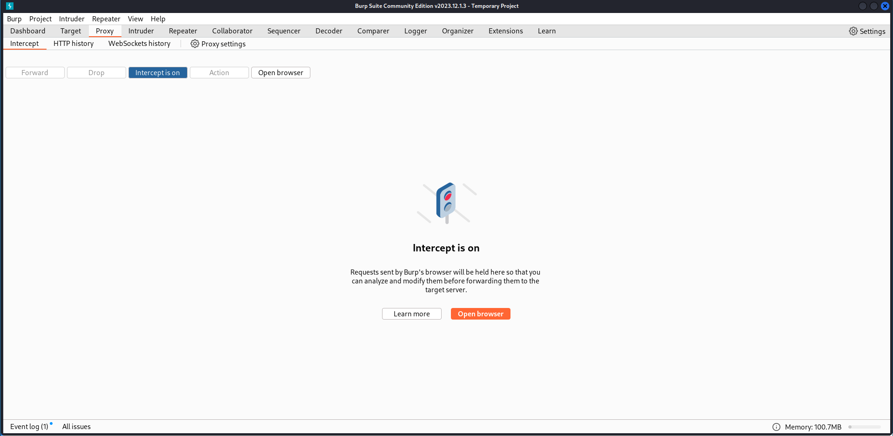
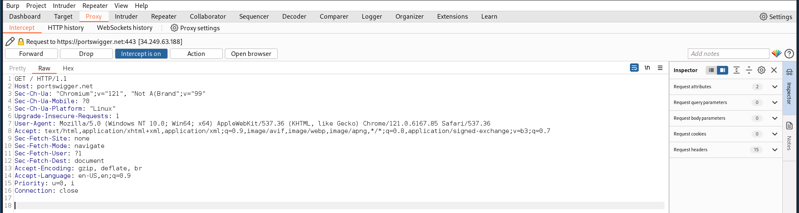
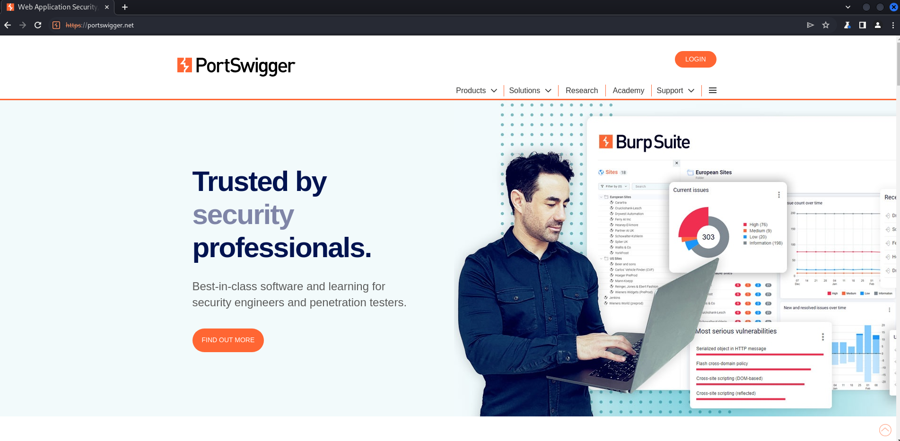
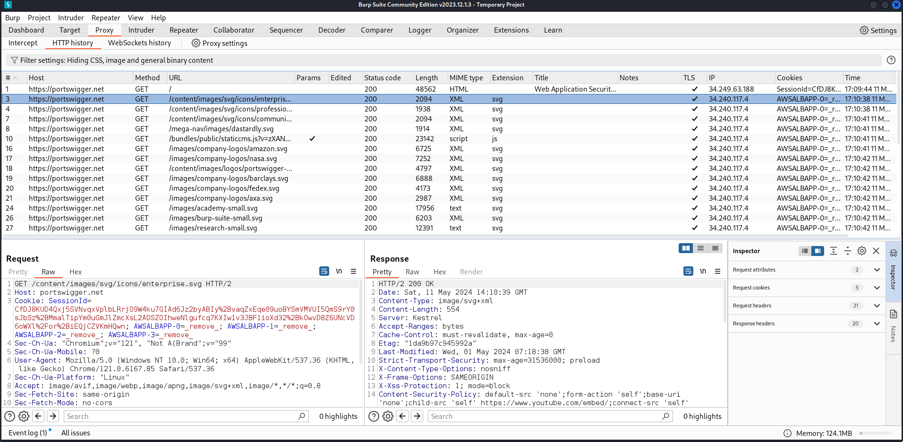
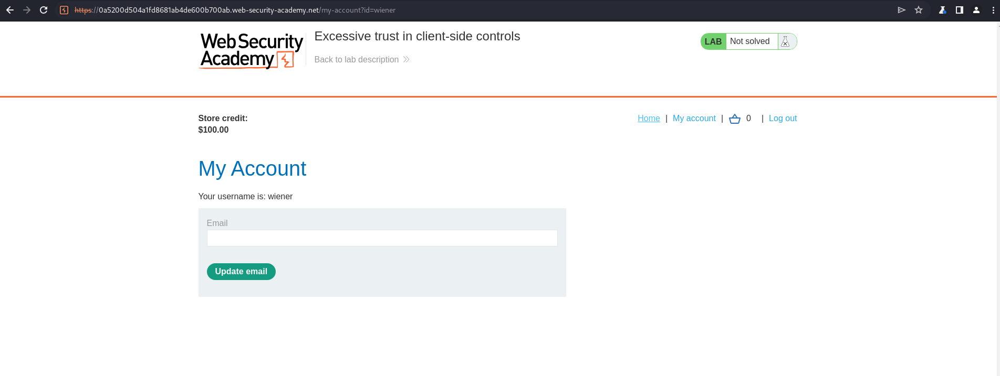
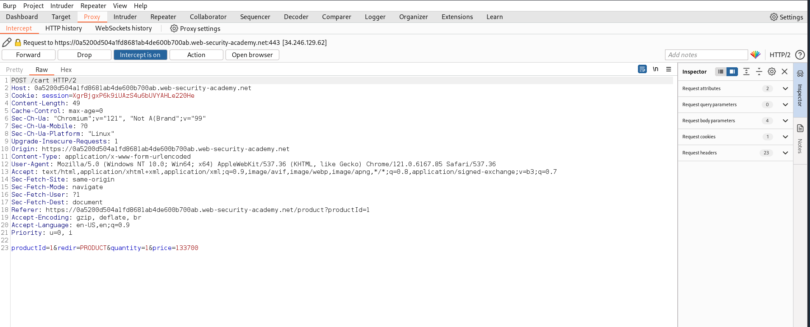
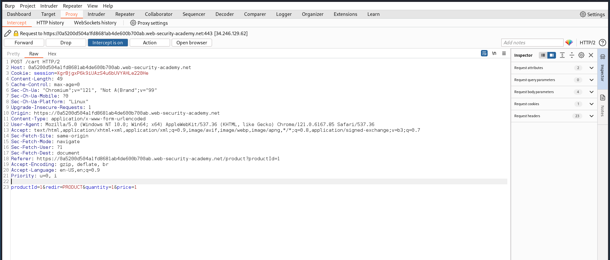
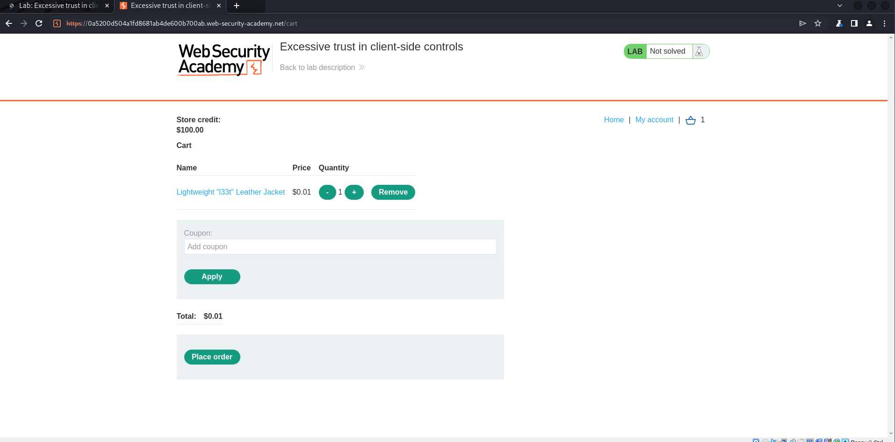
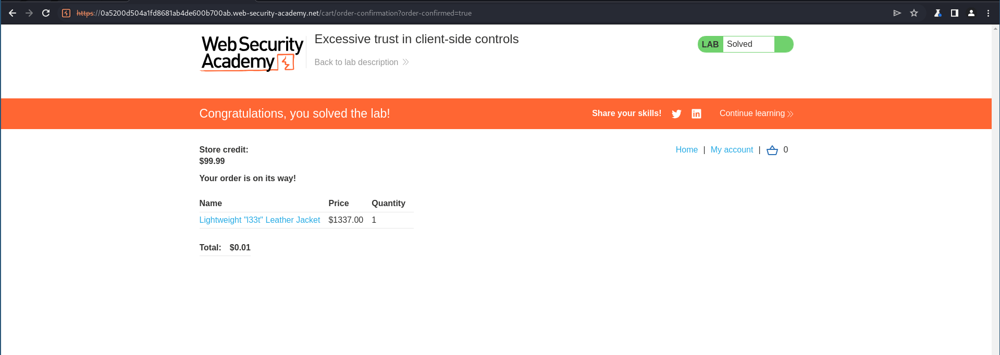

---
## Front matter
lang: ru-RU
title: "Индивидуальный проект. Этап 5."
subtitle: "Использование Burp Suite"
author: 
author:
  - Стариков Данила Андреевич

date: 11 мая 2024

## i18n babel
babel-lang: russian
babel-otherlangs: english

## Formatting pdf
toc: false
toc-title: Содержание
slide_level: 2
aspectratio: 169
section-titles: true
theme: metropolis
header-includes:
 - \metroset{progressbar=frametitle,sectionpage=progressbar,numbering=fraction}
 - '\makeatletter'
 - '\beamer@ignorenonframefalse'
 - '\makeatother'
---

# Цели и задачи

- Познакомиться с экосистемой Burp Suite для поиска уязвимостей веб-приложений и демонстрации возможностей злоумышленника

# Результаты

## Знакомство с интерфейсом приложения

{#fig:1 width=70%}

## Знакомство с интерфейсом приложения

{#fig:2 width=70%}

## Знакомство с интерфейсом приложения

{#fig:3 width=70%}

## Знакомство с интерфейсом приложения

{#fig:4 width=70%}

## Перехват и модификация HTTP запроса

{#fig:5 width=70%}

## Перехват и модификация HTTP запроса

{#fig:6 width=70%}

## Перехват и модификация HTTP запроса

{#fig:7 width=70%}

## Перехват и модификация HTTP запроса

{#fig:8 width=70%}

## Перехват и модификация HTTP запроса

{#fig:9 width=70%}

## Перехват и модификация HTTP запроса

{#fig:10 width=70%}

# Итог

- В результате работы познакомились с экосистемой `Burp Suite` и продемонтсрировали ее работу при перехвате и модификации HTTP запроса.

