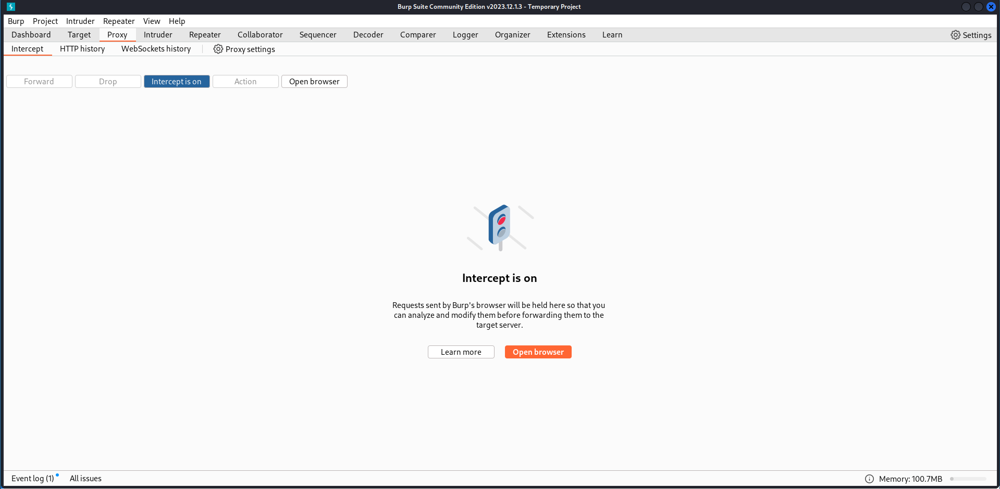
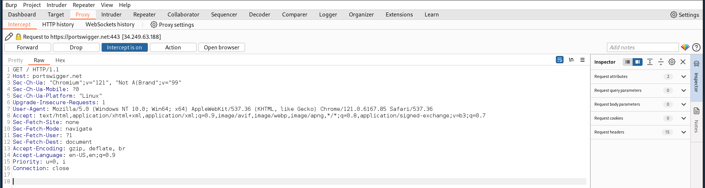
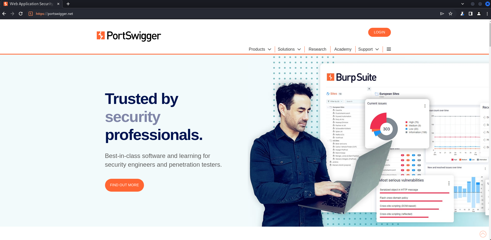
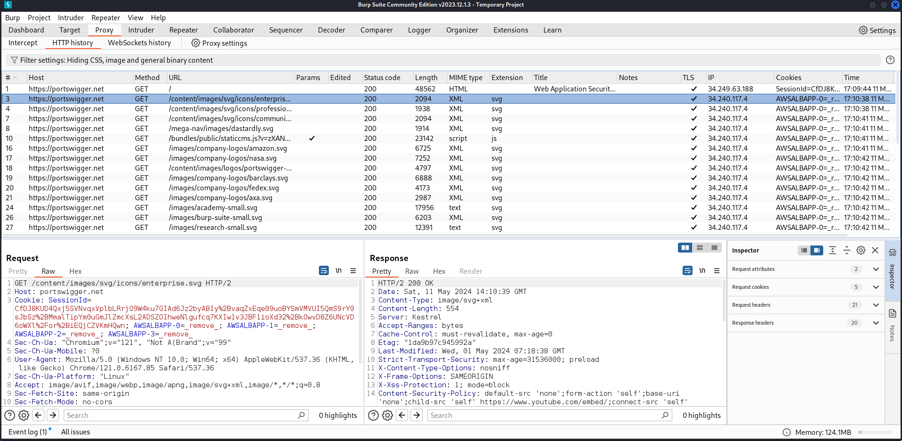
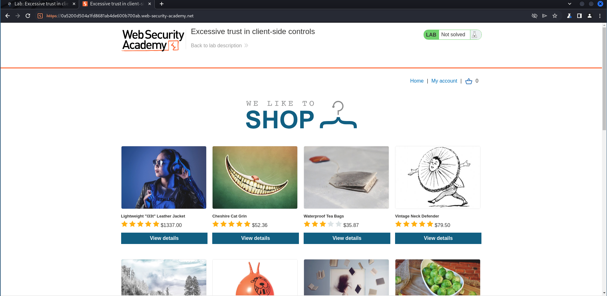
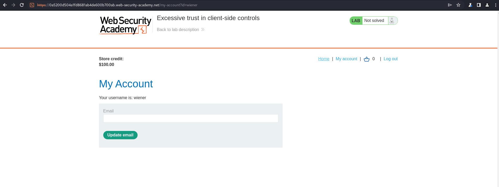
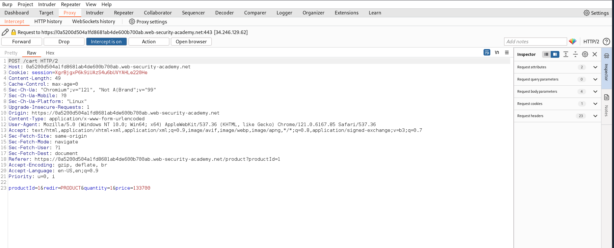
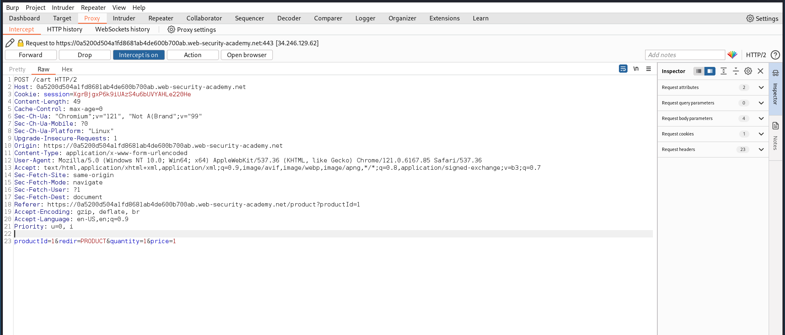
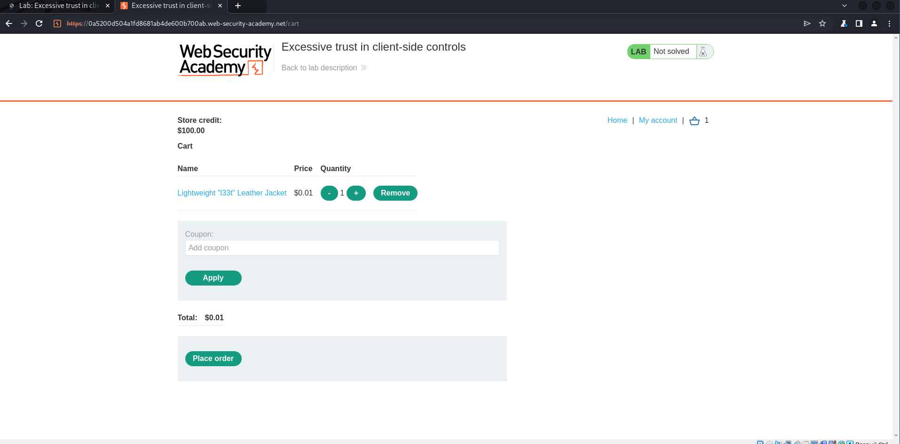
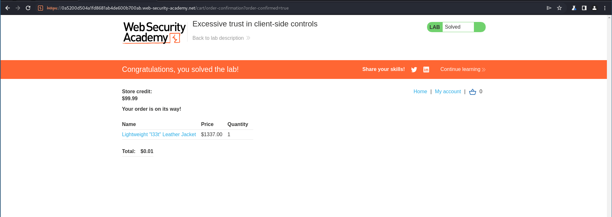

---
## Front matter
title: "Индивидуальный проект."
subtitle: "Этап 5. Использование Burp Suite"
author: "Стариков Данила НПИбд-02-22"

## Generic otions
lang: ru-RU
toc-title: "Содержание"

## Bibliography
bibliography: bib/cite.bib
csl: pandoc/csl/gost-r-7-0-5-2008-numeric.csl

## Pdf output format
toc: true # Table of contents
toc-depth: 2
lof: false # List of figures
lot: false # List of tables
fontsize: 12pt
linestretch: 1.5
papersize: a4
documentclass: scrreprt
## I18n polyglossia
polyglossia-lang:
  name: russian
  options:
	- spelling=modern
	- babelshorthands=true
polyglossia-otherlangs:
  name: english
## I18n babel
babel-lang: russian
babel-otherlangs: english
## Fonts
mainfont: PT Serif
romanfont: PT Serif
sansfont: PT Sans
monofont: PT Mono
mainfontoptions: Ligatures=TeX
romanfontoptions: Ligatures=TeX
sansfontoptions: Ligatures=TeX,Scale=MatchLowercase
monofontoptions: Scale=MatchLowercase,Scale=0.9
## Biblatex
biblatex: true
biblio-style: "gost-numeric"
biblatexoptions:
  - parentracker=true
  - backend=biber
  - hyperref=auto
  - language=auto
  - autolang=other*
  - citestyle=gost-numeric
## Pandoc-crossref LaTeX customization
figureTitle: "Рис."
tableTitle: "Таблица"
listingTitle: "Листинг"
lofTitle: "Список иллюстраций"
lotTitle: "Список таблиц"
lolTitle: "Листинги"
## Misc options
indent: true
header-includes:
  - \usepackage{indentfirst}
  - \usepackage{float} # keep figures where there are in the text
  - \floatplacement{figure}{H} # keep figures where there are in the text
---

# Цель работы

Познакомиться с экосистемой Burp Suite для поиска уязвимостей веб-приложений и демонстрации возможностей злоумышленника.

# Выполнение работы

## Знакомство с интерфейсом приложения

Burp Suite представляет собой набор мощных инструментов безопасности веб-приложений, которые демонстрируют реальные возможности злоумышленника, проникающего в веб-приложения. Открыли приложение и перешли во вкладку `Proxy` -> `Intercept` (Рис. [-@fig:1]).

{#fig:1 width=70%}

Кнопка `Intercept` позволяет перехватывать все HTTP запросы, которые будут поступать. Для демонстрации перешли на сайт компании <portswigger.net>. Загрузка не началась, так как запрос был перехвачен приложением, посмотрели как он выглядит (Рис. [-@fig:2]):

{#fig:2 width=70%}

Нажатие кнопки `Forward` отправляет перехваченный запрос, и страница прогружается (Рис. [-@fig:3]). Далее отключили перехват `Intercept off`.` 

{#fig:3 width=70%}

Во вкладке `HTTP history` можно посмотреть все проходящие запросы, даже если их перехват был выключен (Рис. [-@fig:4]):

{#fig:4 width=70%}

## Перехват и модификация HTTP запроса

Разработчики Burp Suite сделали серию гайдов для знакомства с приложением, прошли один из них: `Modifying requests` (Изменяем запросы) [@portswigger]. Перешли на тестовый сайт онлайн-магазин (перед этим необходимо зарегистрироваться) <https://portswigger.net/web-security/logic-flaws/examples/lab-logic-flaws-excessive-trust-in-client-side-controls> (Рис. [-@fig:5]):

{#fig:5 width=70%}

Зашли в личный кабинет (My account) под пользователем `wiener` (пароль: `peter`) и увидели, что на счету 100 долларов (Рис. [-@fig:6]).

{#fig:6 width=70%}

Вернулись на главную страницу (Home). Перед тем, как что-либо купить, открыли `brupsuite` и включили перехват пакетов `Intercept on`. Затем добавили в корзину товар и открыли перехваченный HTTP запрос (Рис. [-@fig:7]):

{#fig:7 width=70%}

Нашли поле `price`, изменили значение на `1`, отправили его (`Forward`) и отключили перехват (`Intercept off`) (Рис. [-@fig:8]):

{#fig:8 width=70%}

Перешли в корзину и увидели, что стоимость товара поменялась на указанную в запросе (Рис. [-@fig:9]).

{#fig:9 width=70%}

Нажали кнопку `Place Order` и завершили этот тестовый пример. Счет на аккаунте изменился всего на один цент (Рис. [-@fig:10]).

{#fig:10 width=70%}

# Выводы

В результате работы познакомились с экосистемой `Burp Suite` и продемонтсрировали ее работу при перехвате и модификации HTTP запроса.

# Список литературы{.unnumbered}

::: {#refs}
:::
```

