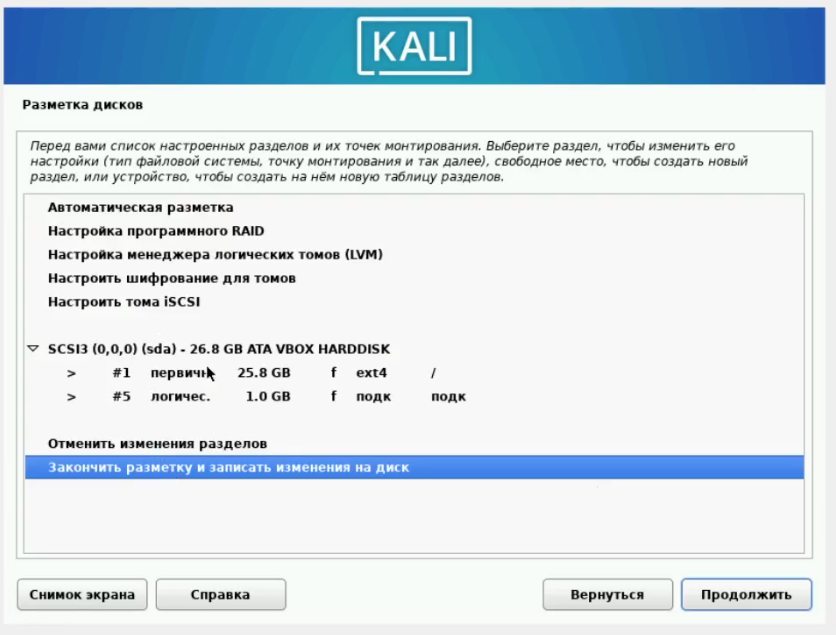
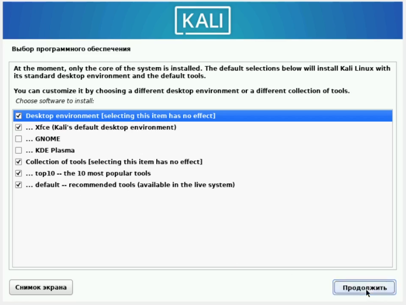

---
## Front matter
lang: ru-RU
title: Индивидуальный проект. Этап 1. Установка дистрибутива Kali Linux
## subtitle: Простейший шаблон
author:
  - Стариков Д. А.
institute:
  - Российский университет дружбы народов, Москва, Россия
date: 02 марта 2023

## i18n babel
babel-lang: russian
babel-otherlangs: english

## Formatting pdf
toc: false
toc-title: Содержание
slide_level: 2
aspectratio: 169
section-titles: true
theme: metropolis
header-includes:
 - \metroset{progressbar=frametitle,sectionpage=progressbar,numbering=fraction}
 - '\makeatletter'
 - '\beamer@ignorenonframefalse'
 - '\makeatother'
---

# Цели и задачи

- Установить и настроить дистрибутив Kali Linux как виртуальный машину в VirtualBox.

# Результаты

## Создание виртуальной машины

{#fig:15 width=70%}

## Создание виртуальной машины

{#fig:14 width=70%}

## Создание виртуальной машины

{#fig:13 width=70%}

## Установка дистрибутива

{#fig:12 width=70%}

## Установка дистрибутива

{#fig:11 width=70%}

## Установка дистрибутива

{#fig:10 width=70%}

## Установка дистрибутива

{#fig:9 width=70%}

## Установка дистрибутива

{#fig:7 width=70%}

## Установка дистрибутива

{#fig:6 width=70%}

## Установка дистрибутива

{#fig:5 width=70%}

## Установка дистрибутива

{#fig:4 width=70%}

## Проверка корректности установки

{#fig:18 width=70%}

## Проверка корректности установки

{#fig:17 width=70%}

# Итог

- В рамках Этапа №1 индивидуального проекта установили и настроили дистрибутив Kali Linux в VirtualBox.

