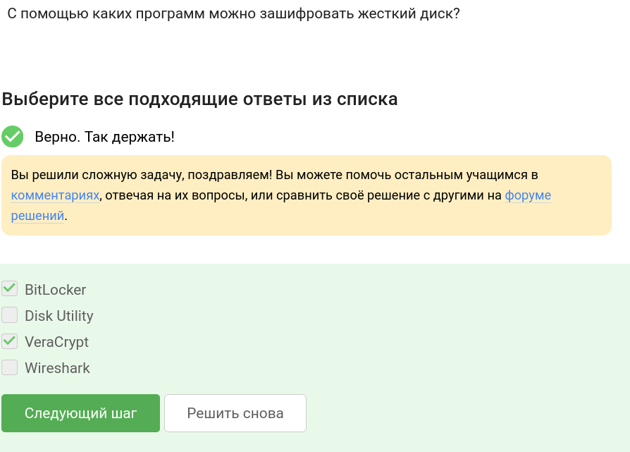
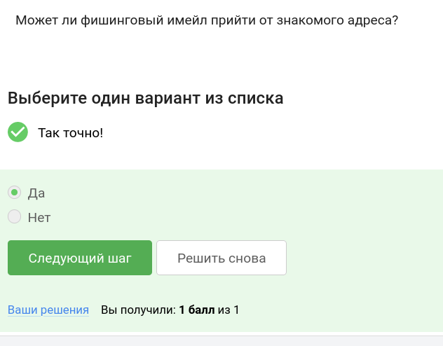
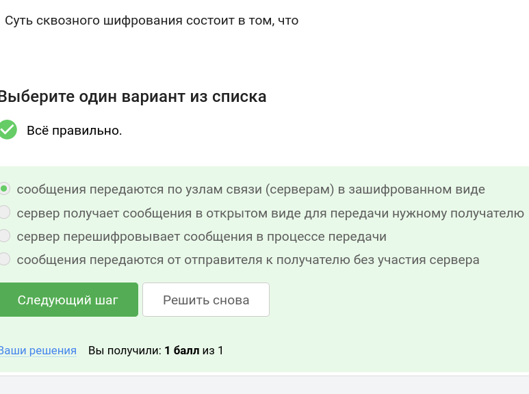
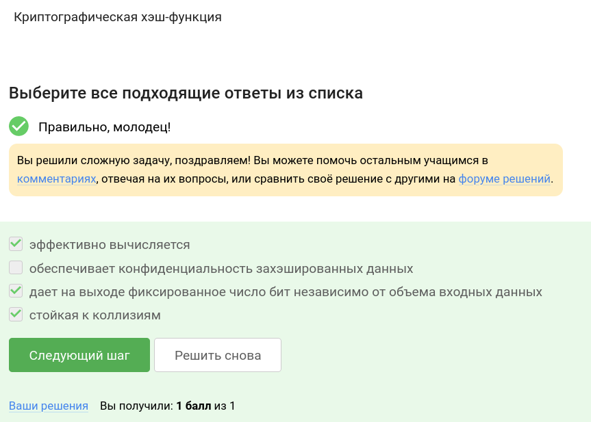
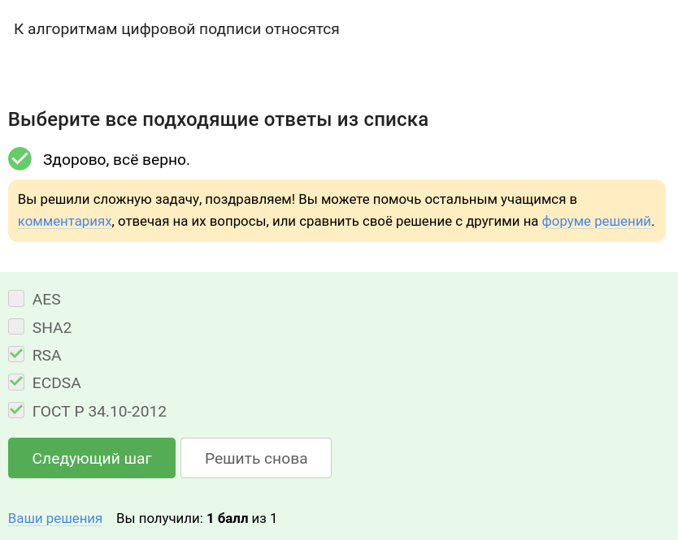
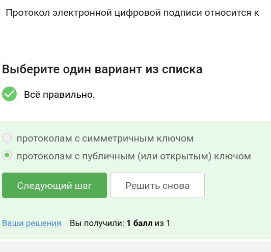
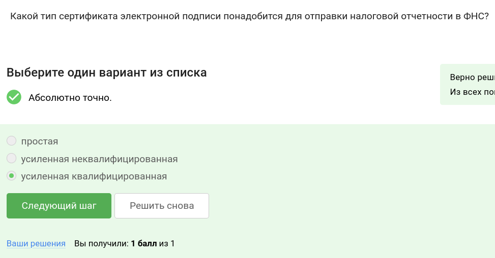
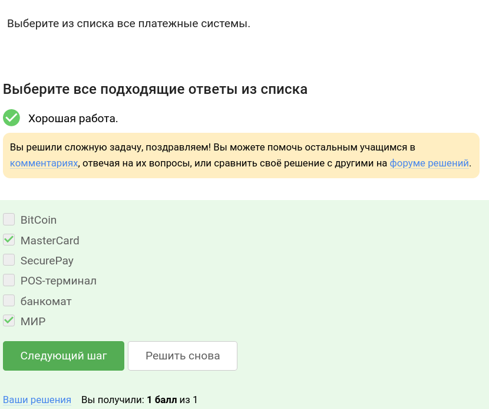
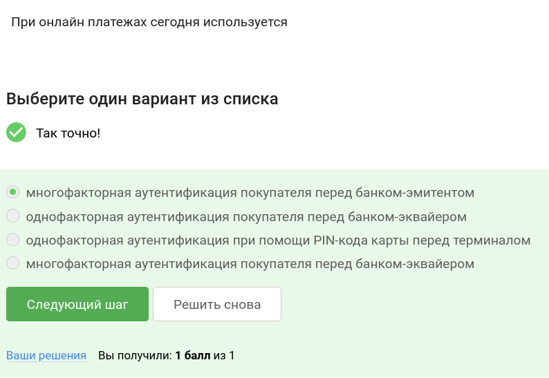

---
## Front matter
title: "Отчет по части \"Безопасность в сети\" курса \"Основы кибербезопасности\""
author: "Стариков Данила Андреевич"

## Generic otions
lang: ru-RU
toc-title: "Содержание"

## Bibliography
bibliography: bib/cite.bib
csl: pandoc/csl/gost-r-7-0-5-2008-numeric.csl

## Pdf output format
toc: true # Table of contents
toc-depth: 2

fontsize: 12pt
linestretch: 1.5
papersize: a4
documentclass: scrreprt
## I18n polyglossia
polyglossia-lang:
  name: russian
  options:
	- spelling=modern
	- babelshorthands=true
polyglossia-otherlangs:
  name: english
## I18n babel
babel-lang: russian
babel-otherlangs: english
## Fonts
mainfont: PT Serif
romanfont: PT Serif
sansfont: PT Sans
monofont: PT Mono
mainfontoptions: Ligatures=TeX
romanfontoptions: Ligatures=TeX
sansfontoptions: Ligatures=TeX,Scale=MatchLowercase
monofontoptions: Scale=MatchLowercase,Scale=0.9
## Biblatex
biblatex: true
biblio-style: "gost-numeric"
biblatexoptions:
  - parentracker=true
  - backend=biber
  - hyperref=auto
  - language=auto
  - autolang=other*
  - citestyle=gost-numeric
## Pandoc-crossref LaTeX customization
figureTitle: "Рис."
tableTitle: "Таблица"
listingTitle: "Листинг"
lofTitle: "Список иллюстраций"
lotTitle: "Список таблиц"
lolTitle: "Листинги"
## Misc options
indent: true
header-includes:
  - \usepackage{indentfirst}
  - \usepackage{float} # keep figures where there are in the text
  - \floatplacement{figure}{H} # keep figures where there are in the text
---

# Цель работы {-}

Цель курса:

- Понять, как происходит передача данных через Интернет, какие уязвимости могут возникнуть

- Разобраться, почему необходимо составлять сложные пароли

- Научиться различать шифрованиие и цифровую подпись

- Изучать работу электронных платежей

# Первый модуль. Безопасность в сети.

## Как работает интернет: базовые сетевые протоколы

- Вопрос 1. Выберите протокол прикладного уровня (рис. [-@fig:p1_1]):

Ответ: *HTTPS*.

{#fig:p1_1 width=70%}

- Вопрос 2. На каком уровне работает протокол TCP? (рис. [-@fig:p1_2])

Ответ: *Транспортном*.

{#fig:p1_2 width=70%}

- Вопрос 3. Выберите все корректные адреса IPv4. (рис. [-@fig:p1_3])

Ответ: *90.11.90.22 и 25.198.0.15*.

{#fig:p1_3 width=70%}

- Вопрос 4. DNS сервер (рис. [-@fig:p1_4])

Ответ: *сопоставляет IP адреса доменным именам*.

{#fig:p1_4 width=70%}

- Вопрос 5. Выберите корректную последовательность протоколов в модели TCP/IP (рис. [-@fig:p1_5])

Ответ: *прикладной -- транспортный -- сетевой -- канальный*.

{#fig:p1_5 width=70%}

- Вопрос 6. Протокол http предполагает (рис. [-@fig:p1_6])

Ответ: *передачу данных между клиентом и сервером в открытом виде*.

{#fig:p1_6 width=70%}

- Вопрос 7. Протокол https состоит из (рис. [-@fig:p1_7])

Ответ: *двух фаз: рукопожатия и передачи данных*.

{#fig:p1_7 width=70%}

- Вопрос 8. Версия протокола TLS определяется (рис. [-@fig:p1_8])

Ответ: *и клиентом, и сервером в процессе "переговоров"*.

{#fig:p1_8 width=70%}

- Вопрос 9. В фазе "рукопожатия" протокола TLS не предусмотрено (рис. [-@fig:p1_9])

Ответ: *шифрование данных*.

{#fig:p1_9 width=70%}

## Персонализация сети

 - Вопрос 1. Куки хранят: (рис. [-@fig:p1_10])

 Ответ: *идентификатор пользователя и id сессии*

{#fig:p1_10 width=70%}

 - Вопрос 2. Куки не используются для (рис. [-@fig:p1_11])

 Ответ: *улучшения надежности соединения*

{#fig:p1_11 width=70%}

 - Вопрос 3. Куки генерируются (рис. [-@fig:p1_12])

 Ответ: *сервером*

{#fig:p1_12 width=70%}

 - Вопрос 4. Сессионные куки хранятся в браузере? (рис. [-@fig:p1_13])

 Ответ: *Да, на время пользования веб-сайтом*

{#fig:p1_13 width=70%}

## Браузер TOR. Анонимизация

 - Вопрос 1. Сколько промежуточных узлов в луковой сети TOR? (рис. [-@fig:p1_14])

 Ответ: *3*

{#fig:p1_14 width=70%}

 - Вопрос 2. IP-адрес получателя известен (рис. [-@fig:p1_15])

 Ответ: *отправителю и выходному узлу*

{#fig:p1_15 width=70%}

 - Вопрос 3. Отправитель генерирует общий секретный ключ (рис. [-@fig:p1_16])

 Ответ: *с охранным, промежуточным и выходном узлом*

{#fig:p1_16 width=70%}

 - Вопрос 4. Должен ли получатель использовать браузер Tor (или другой браузер, основанный на луковой маршрутизации) для успешного получения пакетов? (рис. [-@fig:p1_17])

 Ответ: *Нет*

{#fig:p1_17 width=70%}

## Беспроводные сети Wi-Fi.

 - Вопрос 1. Wi-Fi - это (рис. [-@fig:p1_18])

 Ответ: *технология беспроводной локальной сети, работающая в соответствии со стандартом IEEE 802.11*

{#fig:p1_18 width=70%}

 - Вопрос 2. На каком уровне работает протокол WiFi? (рис. [-@fig:p1_19])

 Ответ: *Канальном*

{#fig:p1_19 width=70%}

 - Вопрос 3. Небезопасный метод обеспечения шифрования и аутентификации в сети Wi-Fi (рис. [-@fig:p1_20])

 Ответ: *WEP*

{#fig:p1_20 width=70%}

 - Вопрос 4. Данные между хостом сети (компьютером или смартфоном) и роутером (рис. [-@fig:p1_21])

 Ответ: *передаются в зашифрованном виде после аутентификации устройств*

{#fig:p1_21 width=70%}

 - Вопрос 5. Для домашней сети для аутентификации обычно используется метод (рис. [-@fig:p1_22])

 Ответ: *WPA2 Personal*

{#fig:p1_22 width=70%}

# Второй модуль. Защита ПК/Телефона.

## Шифрование диска

- Вопрос 1. Можно ли зашифровать загрузочный сектор диска (рис. [-@fig:p2_1])

Ответ: *Да*.

{#fig:p2_1 width=70%}

- Вопрос 2. Шифрование диска основано на (рис. [-@fig:p2_2])

Ответ: *симметричном шифровании*.

{#fig:p2_2 width=70%}

- Вопрос 3. С помощью каких программ можно зашифровать жесткий диск? (рис. [-@fig:p2_3])

Ответ: *BitLocker и VeraCrypt*.

{#fig:p2_3 width=70%}

## Пароли

- Вопрос 1. Какие пароли можно отнести с стойким? (рис. [-@fig:p2_4])

Ответ: *UQr9@j4!S$*.

{#fig:p2_4 width=70%}

- Вопрос 2. Где безопасно хранить пароли? (рис. [-@fig:p2_5])

Ответ: *В менеджерах паролей*.

{#fig:p2_5 width=70%}

- Вопрос 3. Зачем нужна капча? (рис. [-@fig:p2_6])

Ответ: *Для защиты от автоматизированных атак, направленных на получение несанкционированного доступа*.

{#fig:p2_6 width=70%}

- Вопрос 4. Для чего применяется хэширование паролей? (рис. [-@fig:p2_7])

Ответ: *Для того, чтобы не хранить пароли на сервере в открытом виде.*.

{#fig:p2_7 width=70%}

- Вопрос 5. Поможет ли соль для улучшения стойкости паролей к атаке перебором, если злоумышленник получил доступ к серверу? (рис. [-@fig:p2_8])

Ответ: *Нет*.

{#fig:p2_8 width=70%}

- Вопрос 6. Какие меры защищают от утечек данных атакой перебором? (рис. [-@fig:p2_9])

Ответ: *разные пароли на всех сайтах, периодическая смена паролей, сложные(=длинные) пароли, капча*.

{#fig:p2_9 width=70%}

## Фишинг

- Вопрос 1. Какие из следующих ссылок являются фишинговыми? (рис. [-@fig:p2_10])

Ответ: *https://online.sberbank.wix.ru/CSAFront/index.do (вход в Сбербанк.Онлайн) и https://passport.yandex.ucoz.ru/auth?origin=home_desktop_ru (вход в аккаунт Яндекс)*.

{#fig:p2_10 width=70%}

- Вопрос 2. Может ли фишинговый имейл прийти от знакомого адреса? (рис. [-@fig:p2_11])

Ответ: *Да*.

{#fig:p2_11 width=70%}

## Вирусы. Примеры

- Вопрос 1. Email Спуфинг -- это (рис. [-@fig:p2_12])

Ответ: *подмена адреса отправителя в имейлах*.

{#fig:p2_12 width=70%}

- Вопрос 2. Вирус-троян (рис. [-@fig:p2_13])

Ответ: *маскируется под легитимную программу*.

{#fig:p2_13 width=70%}

## Безопасность мессенджеров

- Вопрос 1. На каком этапе формируется ключ шифрования в протоколе мессенджеров Signal? (рис. [-@fig:p2_14])

Ответ: *при генерации первого сообщения стороной-отправителем*.

{#fig:p2_14 width=70%}

- Вопрос 2. Суть сквозного шифрования состоит в том, что (рис. [-@fig:p2_15])

Ответ: *сообщения передаются по узлам связи (серверам) в зашифрованном виде*.

{#fig:p2_15 width=70%}

# Третий модуль. Криптография на практике.

##  Введение в криптографию
 
- Вопрос 1. В асимметричных криптографических примитивах (рис. [-@fig:p3_1]):

Ответ: *обе стороны имеют пару ключей*.

{#fig:p3_1 width=70%}

- Вопрос 2. Криптографическая хэш-функция (рис. [-@fig:p3_2]):

Ответ: *эффективно вычисляется, дает на выходе фиксированное число бит независимо от объема входных данных, стойкая к коллизиям*.

{#fig:p3_2 width=70%}
 
- Вопрос 3. К алгоритмам цифровой подписи относятся (рис. [-@fig:p3_3]):

Ответ: *RSA, ECDSA, ГОСТ Р 34.10-2012 *.

{#fig:p3_3 width=70%}
 
- Вопрос 4. Код аутентификации сообщения относится к (рис. [-@fig:p3_4]):

Ответ: *симметричным примитивам*.

{#fig:p3_4 width=70%}
 
- Вопрос 5. Обмен ключам Диффи-Хэллмана - это (рис. [-@fig:p3_5]):

Ответ: *асимметричный примитив генерации общего секретного ключа*.

{#fig:p3_5 width=70%}

##  Цифровая подпись

- Вопрос 1. Протокол электронной цифровой подписи относится к (рис. [-@fig:p3_6]):

Ответ: *протоколам с публичным (или открытым) ключом*.

{#fig:p3_6 width=70%}

- Вопрос 2. Алгоритм верификации электронной цифровой подписи требует на вход (рис. [-@fig:p3_7]):

Ответ: *подпись, открытый ключ, сообщение*.

{#fig:p3_7 width=70%}

- Вопрос 3. Электронная цифровая подпись не обеспечивает (рис. [-@fig:p3_8]):

Ответ: *конфиденциальность*.

{#fig:p3_8 width=70%}

- Вопрос 4. Какой тип сертификата электронной подписи понадобится для отправки налоговой отчетности в ФНС? (рис. [-@fig:p3_9]):

Ответ: *усиленная квалифицированная*.

{#fig:p3_9 width=70%}

- Вопрос 5. В какой организации вы можете получить квалифицированный сертификат ключа проверки электронной подписи? (рис. [-@fig:p3_10]):

Ответ: *в удостоверяющем (сертификационном) центре*.

{#fig:p3_10 width=70%}

##  Электронные платежи

- Вопрос 1. Выберите из списка все платежные системы. (рис. [-@fig:p3_11]):

Ответ: *MasterCard, МИР*.

{#fig:p3_11 width=70%}

- Вопрос 2. Примером многофакторной аутентификации является (рис. [-@fig:p3_12]):

Ответ: *комбинация проверка пароля + код в sms сообщении, комбинация код в sms сообщении + отпечаток пальца *.

{#fig:p3_12 width=70%}

- Вопрос 3. При онлайн платежах сегодня используется (рис. [-@fig:p3_13]):

Ответ: *многофакторная аутентификация покупателя перед банком-эмитентом*.

{#fig:p3_13 width=70%}

##  Блокчейн

- Вопрос 1. Какое свойство криптографической хэш-функции используется в доказательстве работы? (рис. [-@fig:p3_14]):

Ответ: *сложность нахождения прообраза*.

{#fig:p3_14 width=70%}

- Вопрос 2. Консенсус в некоторых системах блокчейн обладает свойствами (рис. [-@fig:p3_15]):

Ответ: *постоянства, консенсус, живучесть, открытость*.

{#fig:p3_15 width=70%}

- Вопрос 3. Секретные ключи какого криптографического примитива хранят участники блокчейна? (рис. [-@fig:p3_16]):

Ответ: *цифровая подпись*.

{#fig:p3_16 width=70%}

# Выводы

В рамках прохождения курса разобрались в схеме передачи данных через Интернет, их шифровании. Получили практические советы по выбору более качественного пароля. Научились отличать шифрование от цифровой подписи, поняли, как работают системы электронных платежей.
