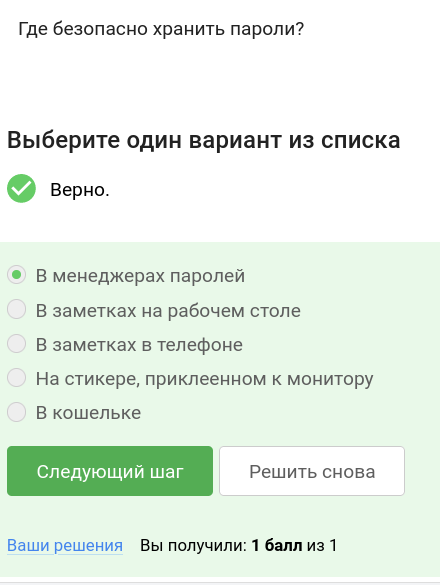
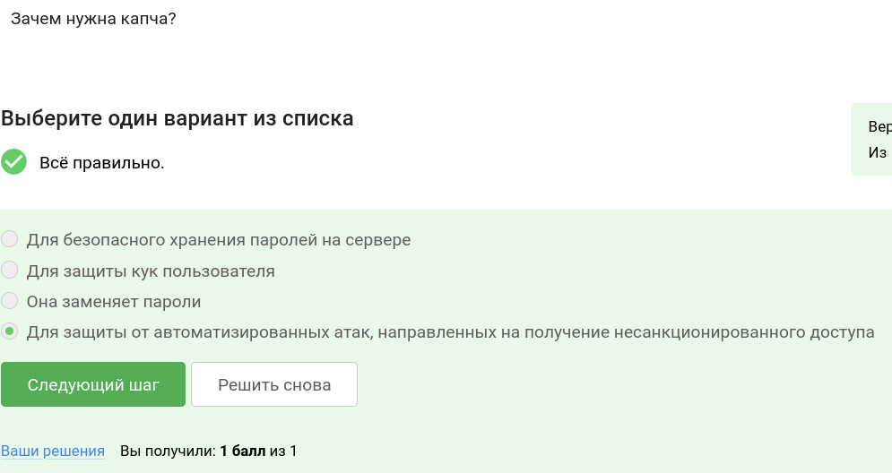
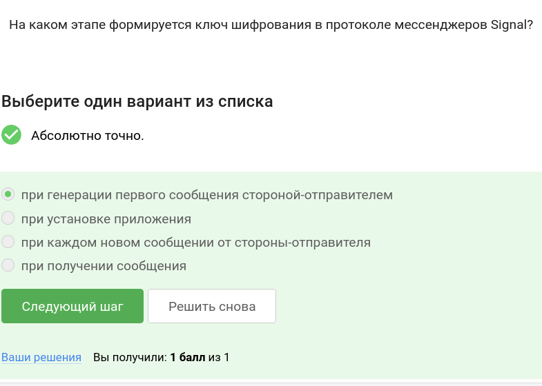

---
## Front matter
title: "Отчет по части \"Защита ПК/телефона\" курса \"Основы кибербезопасности\""
author: "Стариков Данила Андреевич"

## Generic otions
lang: ru-RU
toc-title: "Содержание"

## Bibliography
bibliography: bib/cite.bib
csl: pandoc/csl/gost-r-7-0-5-2008-numeric.csl

## Pdf output format
toc: true # Table of contents
toc-depth: 2

fontsize: 12pt
linestretch: 1.5
papersize: a4
documentclass: scrreprt
## I18n polyglossia
polyglossia-lang:
  name: russian
  options:
	- spelling=modern
	- babelshorthands=true
polyglossia-otherlangs:
  name: english
## I18n babel
babel-lang: russian
babel-otherlangs: english
## Fonts
mainfont: PT Serif
romanfont: PT Serif
sansfont: PT Sans
monofont: PT Mono
mainfontoptions: Ligatures=TeX
romanfontoptions: Ligatures=TeX
sansfontoptions: Ligatures=TeX,Scale=MatchLowercase
monofontoptions: Scale=MatchLowercase,Scale=0.9
## Biblatex
biblatex: true
biblio-style: "gost-numeric"
biblatexoptions:
  - parentracker=true
  - backend=biber
  - hyperref=auto
  - language=auto
  - autolang=other*
  - citestyle=gost-numeric
## Pandoc-crossref LaTeX customization
figureTitle: "Рис."
tableTitle: "Таблица"
listingTitle: "Листинг"
lofTitle: "Список иллюстраций"
lotTitle: "Список таблиц"
lolTitle: "Листинги"
## Misc options
indent: true
header-includes:
  - \usepackage{indentfirst}
  - \usepackage{float} # keep figures where there are in the text
  - \floatplacement{figure}{H} # keep figures where there are in the text
---

# Цель работы

Познакомиться со следующими понятиями:
 - Шифрование диска
 - Пароли, хранилища паролей
 - Защита от вирусов
 - Фишинг
 - Безопасность мессенджеров

# Выполнение лабораторной работы

## Шифрование диска

- Вопрос 1. Можно ли зашифровать загрузочный сектор диска(рис. [-@fig:1])

Ответ: *Да*.

{#fig:1 width=70%}

- Вопрос 2. Шифрование диска основано на(рис. [-@fig:2])

Ответ: *симметричном шифровании*.

{#fig:2 width=70%}

- Вопрос 3. С помощью каких программ можно зашифровать жесткий диск?(рис. [-@fig:3])

Ответ: *BitLocker и VeraCrypt*.

{#fig:3 width=70%}

## Пароли

- Вопрос 1. Какие пароли можно отнести с стойким?(рис. [-@fig:4])

Ответ: *UQr9@j4!S$*.

{#fig:4 width=70%}

- Вопрос 2. Где безопасно хранить пароли?(рис. [-@fig:5])

Ответ: *В менеджерах паролей*.

{#fig:5 width=70%}

- Вопрос 3. Зачем нужна капча?(рис. [-@fig:6])

Ответ: *Для защиты от автоматизированных атак, направленных на получение несанкционированного доступа*.

{#fig:6 width=70%}

- Вопрос 4. Для чего применяется хэширование паролей?(рис. [-@fig:7])

Ответ: *Для того, чтобы не хранить пароли на сервере в открытом виде.*.

{#fig:7 width=70%}

- Вопрос 5. Поможет ли соль для улучшения стойкости паролей к атаке перебором, если злоумышленник получил доступ к серверу?(рис. [-@fig:8])

Ответ: *Нет*.

{#fig:8 width=70%}

- Вопрос 6. Какие меры защищают от утечек данных атакой перебором?(рис. [-@fig:9])

Ответ: *разные пароли на всех сайтах, периодическая смена паролей, сложные(=длинные) пароли, капча*.

{#fig:9 width=70%}

## Фишинг

- Вопрос 1. Какие из следующих ссылок являются фишинговыми?(рис. [-@fig:10])

Ответ: *https://online.sberbank.wix.ru/CSAFront/index.do (вход в Сбербанк.Онлайн) и https://passport.yandex.ucoz.ru/auth?origin=home_desktop_ru (вход в аккаунт Яндекс)*.

{#fig:10 width=70%}

- Вопрос 2. Может ли фишинговый имейл прийти от знакомого адреса?(рис. [-@fig:11])

Ответ: *Да*.

{#fig:11 width=70%}

## Вирусы. Примеры

- Вопрос 1. Email Спуфинг -- это(рис. [-@fig:12])

Ответ: *подмена адреса отправителя в имейлах*.

{#fig:12 width=70%}

- Вопрос 2. Вирус-троян(рис. [-@fig:13])

Ответ: *маскируется под легитимную программу*.

{#fig:13 width=70%}

## Безопасность мессенджеров

- Вопрос 1. На каком этапе формируется ключ шифрования в протоколе мессенджеров Signal?(рис. [-@fig:14])

Ответ: *при генерации первого сообщения стороной-отправителем*.

{#fig:14 width=70%}

- Вопрос 2. Суть сквозного шифрования состоит в том, что(рис. [-@fig:15])

Ответ: *сообщения передаются по узлам связи (серверам) в зашифрованном виде*.

{#fig:15 width=70%}

# Выводы

В рамках второго модуля познакомились с основами защиты ПК и смартфона: шифрование диска, пароли и их хранилища, защита от вирусов, фишинг, безопасность мессенджеров.
