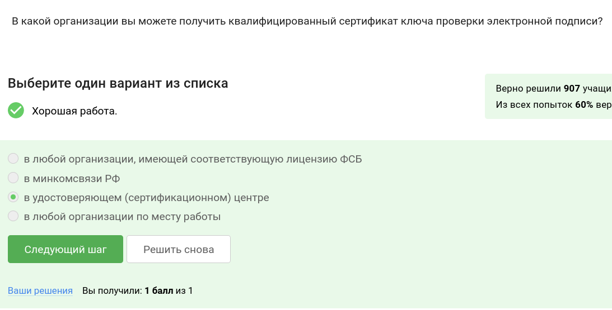
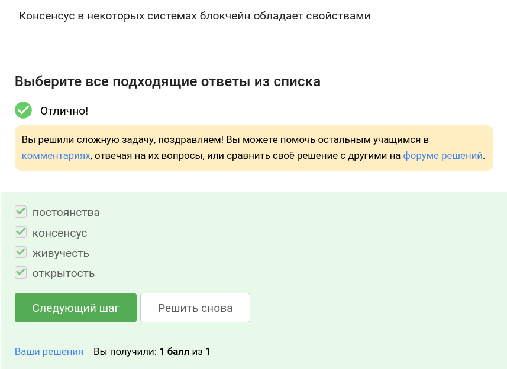

---
## Front matter
title: "Отчет по части \"Криптография на практике\" курса \"Основы кибербезопасности\""
author: "Стариков Данила Андреевич"

## Generic otions
lang: ru-RU
toc-title: "Содержание"

## Bibliography
bibliography: bib/cite.bib
csl: pandoc/csl/gost-r-7-0-5-2008-numeric.csl

## Pdf output format
toc: true # Table of contents
toc-depth: 2

fontsize: 12pt
linestretch: 1.5
papersize: a4
documentclass: scrreprt
## I18n polyglossia
polyglossia-lang:
  name: russian
  options:
	- spelling=modern
	- babelshorthands=true
polyglossia-otherlangs:
  name: english
## I18n babel
babel-lang: russian
babel-otherlangs: english
## Fonts
mainfont: PT Serif
romanfont: PT Serif
sansfont: PT Sans
monofont: PT Mono
mainfontoptions: Ligatures=TeX
romanfontoptions: Ligatures=TeX
sansfontoptions: Ligatures=TeX,Scale=MatchLowercase
monofontoptions: Scale=MatchLowercase,Scale=0.9
## Biblatex
biblatex: true
biblio-style: "gost-numeric"
biblatexoptions:
  - parentracker=true
  - backend=biber
  - hyperref=auto
  - language=auto
  - autolang=other*
  - citestyle=gost-numeric
## Pandoc-crossref LaTeX customization
figureTitle: "Рис."
tableTitle: "Таблица"
listingTitle: "Листинг"
lofTitle: "Список иллюстраций"
lotTitle: "Список таблиц"
lolTitle: "Листинги"
## Misc options
indent: true
header-includes:
  - \usepackage{indentfirst}
  - \usepackage{float} # keep figures where there are in the text
  - \floatplacement{figure}{H} # keep figures where there are in the text
---

# Цель работы

Познакомиться со следующими понятиями:
 - Электронная подпись
 - Электронные платежи
 - Блокчейн

# Выполнение лабораторной работы

##  Введение в криптографию
 
- Вопрос 1. В асимметричных криптографических примитивах(рис. [-@fig:1]):

Ответ: *обе стороны имеют пару ключей*.

{#fig:1 width=70%}

- Вопрос 2. Криптографическая хэш-функция(рис. [-@fig:2]):

Ответ: *эффективно вычисляется, дает на выходе фиксированное число бит независимо от объема входных данных, стойкая к коллизиям*.

{#fig:2 width=70%}
 
- Вопрос 3. К алгоритмам цифровой подписи относятся(рис. [-@fig:3]):

Ответ: *RSA, ECDSA, ГОСТ Р 34.10-2012 *.

{#fig:3 width=70%}
 
- Вопрос 4. Код аутентификации сообщения относится к(рис. [-@fig:4]):

Ответ: *симметричным примитивам*.

{#fig:4 width=70%}
 
- Вопрос 5. Обмен ключам Диффи-Хэллмана - это(рис. [-@fig:5]):

Ответ: *асимметричный примитив генерации общего секретного ключа*.

{#fig:5 width=70%}

##  Цифровая подпись

- Вопрос 1. Протокол электронной цифровой подписи относится к(рис. [-@fig:6]):

Ответ: *протоколам с публичным (или открытым) ключом*.

{#fig:6 width=70%}

- Вопрос 2. Алгоритм верификации электронной цифровой подписи требует на вход(рис. [-@fig:7]):

Ответ: *подпись, открытый ключ, сообщение*.

{#fig:7 width=70%}

- Вопрос 3. Электронная цифровая подпись не обеспечивает(рис. [-@fig:8]):

Ответ: *конфиденциальность*.

{#fig:8 width=70%}

- Вопрос 4. Какой тип сертификата электронной подписи понадобится для отправки налоговой отчетности в ФНС?(рис. [-@fig:9]):

Ответ: *усиленная квалифицированная*.

{#fig:9 width=70%}

- Вопрос 5. В какой организации вы можете получить квалифицированный сертификат ключа проверки электронной подписи?(рис. [-@fig:10]):

Ответ: *в удостоверяющем (сертификационном) центре*.

{#fig:10 width=70%}

##  Электронные платежи

- Вопрос 1. Выберите из списка все платежные системы.(рис. [-@fig:11]):

Ответ: *MasterCard, МИР*.

{#fig:11 width=70%}

- Вопрос 2. Примером многофакторной аутентификации является(рис. [-@fig:12]):

Ответ: *комбинация проверка пароля + код в sms сообщении, комбинация код в sms сообщении + отпечаток пальца *.

{#fig:12 width=70%}

- Вопрос 3. При онлайн платежах сегодня используется(рис. [-@fig:13]):

Ответ: *многофакторная аутентификация покупателя перед банком-эмитентом*.

{#fig:13 width=70%}

##  Блокчейн

- Вопрос 1. Какое свойство криптографической хэш-функции используется в доказательстве работы?(рис. [-@fig:14]):

Ответ: *сложность нахождения прообраза*.

{#fig:14 width=70%}

- Вопрос 2. Консенсус в некоторых системах блокчейн обладает свойствами(рис. [-@fig:15]):

Ответ: *постоянства, консенсус, живучесть, открытость*.

{#fig:15 width=70%}

- Вопрос 3. Секретные ключи какого криптографического примитива хранят участники блокчейна?(рис. [-@fig:16]):

Ответ: *цифровая подпись*.

{#fig:16 width=70%}

# Выводы

В рамках третьего модуля познакомились с основами криптографии: электронной подписью, электронными платежами, блокчейном.
